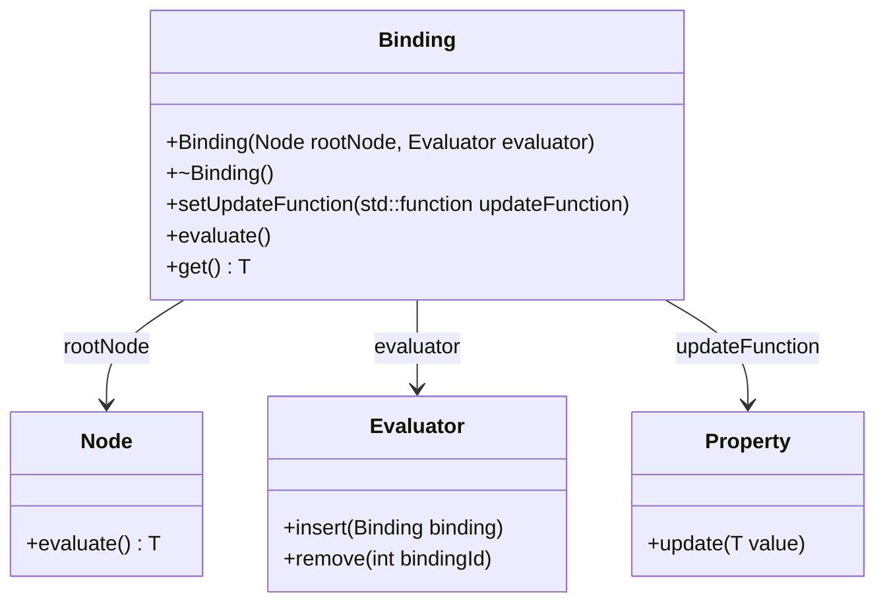
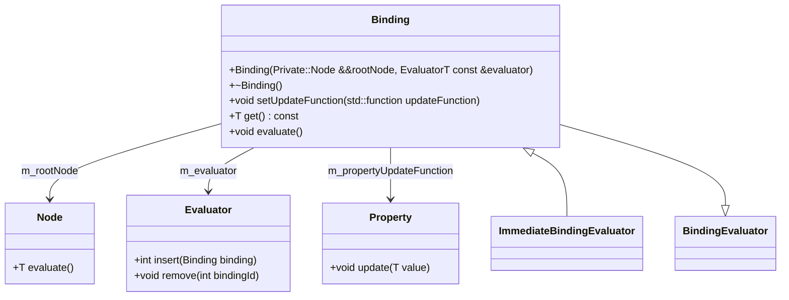

&nbsp;

# Mermaid diagram

Below is a Mermaid diagram illustrating the relationship between the Binding class, nodes, evaluators, and properties:



&nbsp;

&nbsp;

# Introduction

## Class Diagram



This document will walk you through the implementation of the "Class Binding" in the <SwmToken path="/src/kdbindings/binding.h" pos="21:2:2" line-data="namespace KDBindings {">`KDBindings`</SwmToken> library. The purpose of this implementation is to facilitate the creation and management of bindings between properties and evaluators, allowing for dynamic updates and evaluations based on changes in constituent properties.

We will cover:

1. The role of the Binding class and its relationship with nodes and evaluators.
2. The construction and destruction process of a Binding instance.
3. The restrictions on copying and moving Binding instances.
4. The mechanism for updating properties and evaluating expressions.
5. The creation of bindings using helper functions.

# Binding class definition

<SwmSnippet path="/src/kdbindings/binding.h" line="21">

---

The Binding class is central to the <SwmToken path="/src/kdbindings/binding.h" pos="21:2:2" line-data="namespace KDBindings {">`KDBindings`</SwmToken> library. It combines a root Node with an evaluator to manage expressions and their evaluations. The class ensures that any changes in the properties involved in the expression trigger a re-evaluation.

```
namespace KDBindings {

/**
 * @brief A combination of a root Node with an evaluator.
 *
 * A root Node is formed whenever multiple properties are combined inside
 * a expression and an evaluator is responsible for re-evaluating such
 * an expression whenever any of the constituent properties change.
 *
 * @tparam T The type of the value that the Binding expression evaluates to.
 * @tparam EvaluatorT The type of the evaluator that is used to evaluate the Binding.
 */
template<typename T, typename EvaluatorT = BindingEvaluator>
class Binding : public PropertyUpdater<T>, public Private::Dirtyable
{
    static_assert(
            std::is_base_of<BindingEvaluator, EvaluatorT>::value,
            "The EvaluatorT type must inherit from BindingEvaluator.");
```

---

</SwmSnippet>

# Binding construction and destruction&nbsp;

<SwmSnippet path="/src/kdbindings/binding.h" line="47">

---

In this section, we initialize m_rootNode and m_evaluator, insert the current binding into the evaluator to obtain m_bindingId, and assign the parent of this binding.

```c
    explicit Binding(Private::Node<T> &&rootNode, EvaluatorT const &evaluator)
        : m_rootNode{ std::move(rootNode) }
        , m_evaluator{ evaluator }
    {
        m_bindingId = m_evaluator.insert(this);
        m_rootNode.setParent(this);
    }

```

---

</SwmSnippet>

<SwmSnippet path="/src/kdbindings/binding.h" line="40">

---

The Binding class constructor initializes the binding with a root node and an evaluator. It registers the binding with the evaluator, ensuring that the expression is evaluated whenever necessary. The destructor deregisters the binding, cleaning up resources.

```
public:
    /**
     * @brief Construct a new Binding with a specific evaluator.
     *
     * @param rootNode Represents that expression contained in the Binding.
     * @param evaluator Used to evaluate the expression contained in the Binding.
     */
    explicit Binding(Private::Node<T> &&rootNode, EvaluatorT const &evaluator)
        : m_rootNode{ std::move(rootNode) }
        , m_evaluator{ evaluator }
    {
        m_bindingId = m_evaluator.insert(this);
        m_rootNode.setParent(this);
    }

    /** Destructs the Binding by deregistering it from its evaluator. */
    ~Binding() override
    {
        m_evaluator.remove(m_bindingId);
    }
```

---

</SwmSnippet>

# Restrictions on copying and moving

<SwmSnippet path="/src/kdbindings/binding.h" line="61">

---

To maintain the integrity of the binding and its evaluator, the Binding class is designed to prevent copying and moving. This ensures that the binding remains consistent and avoids invalidating pointers.

```
    /** A Binding is not default constructible. */
    Binding() = delete;

    /** A Binding cannot be copy constructed. */
    Binding(Binding const &other) = delete;
    /** A Binding cannot be copy assigned. */
    Binding &operator=(Binding const &other) = delete;

    // Move construction would invalidate the this pointer passed to the evaluator
    // in the constructor
    /** A Binding can not be move constructed. */
    Binding(Binding &&other) = delete;
    /** A Binding can not be move assigned. */
    Binding &operator=(Binding &&other) = delete;
```

---

</SwmSnippet>

# Property updates and evaluation

<SwmSnippet path="/src/kdbindings/binding.h" line="76">

---

The Binding class provides mechanisms to update associated properties and evaluate expressions. The <SwmToken path="/src/kdbindings/binding.h" pos="79:3:3" line-data="    void setUpdateFunction(std::function&lt;void(T &amp;&amp;)&gt; const &amp;updateFunction) override">`setUpdateFunction`</SwmToken>^ method allows specifying a function to notify properties when the binding <SwmToken path="/src/kdbindings/binding.h" pos="77:13:15" line-data="     * associated properties when the Binding re-evaluates.">`re-evaluates`</SwmToken>. The evaluate method <SwmToken path="/src/kdbindings/binding.h" pos="77:13:15" line-data="     * associated properties when the Binding re-evaluates.">`re-evaluates`</SwmToken> the expression and updates properties accordingly.

```
    /** Set the function that should be used to notify
     * associated properties when the Binding re-evaluates.
     */
    void setUpdateFunction(std::function<void(T &&)> const &updateFunction) override
    {
        m_propertyUpdateFunction = updateFunction;
    }

    /** Returns the current value of the Binding. */
    T get() const override { return m_rootNode.evaluate(); }

    /** Re-evaluates the value of the Binding and notifies all dependants of the change. */
    void evaluate()
    {
        T value = m_rootNode.evaluate();

        // Use this to update any associated property via the PropertyUpdater's update function
        m_propertyUpdateFunction(std::move(value));
    }
```

---

</SwmSnippet>

# Helper functions for binding creation

<SwmSnippet path="/src/kdbindings/binding.h" line="110">

---

Several helper functions facilitate the creation of bindings from various inputs, such as properties, nodes, and functions. These functions return unique pointers to Binding instances, allowing for flexible binding creation and management.

```
/**
 * @brief Helper function to create a Binding from a Property.
 *
 * @tparam T The type of the value that the Binding expression evaluates to.
 * @tparam EvaluatorT The type of the evaluator that is used to evaluate the Binding.
 * @param evaluator The evaluator that is used to evaluate the Binding.
 * @param property The Property to create a Binding from.
 * @return std::unique_ptr<Binding<T, EvaluatorT>> A new Binding that is powered by the evaluator.
 *
 * *Note: For the difference between makeBinding and makeBoundProperty, see the
 * ["Reassigning a Binding"](../getting-started/data-binding/#reassigning-a-binding) section in the Getting Started guide.*
 */
template<typename T, typename EvaluatorT>
inline std::unique_ptr<Binding<T, EvaluatorT>> makeBinding(EvaluatorT &evaluator, Property<T> &property)
{
    return std::make_unique<Binding<T, EvaluatorT>>(Private::makeNode(property), evaluator);
}

/**
 * @brief Creates a binding from a const property using a specified evaluator.
 *
 * @tparam T The type of the value that the Binding expression evaluates to.
 * @tparam EvaluatorT The type of the evaluator that is used to evaluate the Binding.
 * @param evaluator The evaluator that is used to evaluate the Binding.
 * @param property The const Property to create a Binding from.
 * @return std::unique_ptr<Binding<T, EvaluatorT>> A new Binding that is powered by the evaluator.
 *
 * *Note: Using a const Property ensures that the source cannot be modified through this binding,
 * maintaining data integrity and supporting scenarios where data should only be observed, not altered.*
 */
template<typename T, typename EvaluatorT>
inline std::unique_ptr<Binding<T, EvaluatorT>> makeBinding(EvaluatorT &evaluator, const Property<T> &property)
{
    return std::make_unique<Binding<T, EvaluatorT>>(Private::makeNode(property), evaluator);
}

/**
 * @brief Helper function to create a Binding from a root Node.
 *
 * @tparam T The type of the value that the Binding expression evaluates to.
 * @tparam EvaluatorT The type of the evaluator that is used to evaluate the Binding.
 * @param evaluator The evaluator that is used to evaluate the Binding.
 * @param rootNode Represents the expression that will be evaluated by the Binding.
 * @return std::unique_ptr<Binding<T, EvaluatorT>> A new Binding that combines the rootNode with the evaluator.
 *
 * *Note: For the difference between makeBinding and makeBoundProperty, see the
 * ["Reassigning a Binding"](../getting-started/data-binding/#reassigning-a-binding) section in the Getting Started guide.*
 */
template<typename T, typename EvaluatorT>
inline std::unique_ptr<Binding<T, EvaluatorT>> makeBinding(EvaluatorT &evaluator, Private::Node<T> &&rootNode)
{
    return std::make_unique<Binding<T, EvaluatorT>>(std::move(rootNode), evaluator);
}

/**
 * @brief Helper function to create a Binding from a function and its arguments.
 *
 * @tparam EvaluatorT The type of the evaluator that is used to evaluate the Binding.
 * @param evaluator The evaluator that is used to evaluate the Binding.
 * @tparam Func The type of the function - may be any type that implements operator().
 * @param func The function object.
 * @tparam Args The function argument types
 * @param args The function arguments - Possible values include: Properties, Constants and Nodes
 *              They will be automatically unwrapped, i.e. a Property<T> will pass a value of type T to func.
 * @return std::unique_ptr<Binding<ReturnType, EvaluatorT>> where ReturnType is the type that results from evaluationg func with the given arguments.
 *          The Binding will be powered by the new evaluator.
 *
 * *Note: For the difference between makeBinding and makeBoundProperty, see the
 * ["Reassigning a Binding"](../getting-started/data-binding/#reassigning-a-binding) section in the Getting Started guide.*
 */
template<typename EvaluatorT, typename Func, typename... Args, typename = std::enable_if_t<sizeof...(Args) != 0>, typename ResultType = Private::operator_node_result_t<Func, Args...>>
inline std::unique_ptr<Binding<ResultType, EvaluatorT>> makeBinding(EvaluatorT &evaluator, Func &&func, Args &&...args)
{
    return std::make_unique<Binding<ResultType, EvaluatorT>>(Private::makeNode(std::forward<Func>(func), std::forward<Args>(args)...), evaluator);
}
```

---

</SwmSnippet>

# Immediate mode bindings

<SwmSnippet path="/src/kdbindings/binding.h" line="186">

---

Immediate mode bindings provide a way to evaluate expressions immediately upon changes in dependent properties. This is useful in scenarios where quick updates are necessary, such as in GUI applications.

```
/**
 * @brief Provides a convenience for old-school, immediate mode Bindings.
 *
 * This works in conjunction with a do-nothing ImmediateBindingEvaluator class to update the
 * result of the Binding immediately upon any of the dependent bindables (i.e. Property instances)
 * notifying that they have changed. This can lead to a Property Binding being evaluated many
 * times before the result is ever used in a typical GUI application.
 *
 * @tparam T The type of the value that the Binding expression evaluates to.
 */
template<typename T>
class Binding<T, ImmediateBindingEvaluator> : public Binding<T, BindingEvaluator>
{
public:
    /**
     * @brief Construct a new Binding with an immediate mode evaluator.
     *
     * @param rootNode Represents that expression contained in the Binding.
     */
    explicit Binding(Private::Node<T> &&rootNode)
        : Binding<T, BindingEvaluator>(std::move(rootNode), ImmediateBindingEvaluator::instance())
    {
    }
```

---

</SwmSnippet>

<SwmSnippet path="/src/kdbindings/binding.h" line="231">

---

&nbsp;

```
/**
 * @brief Helper function to create an immediate mode Binding from a Property.
 *
 * @tparam T The type of the value that the Binding expression evaluates to.
 * @param property The Property to create a Binding from.
 * @return std::unique_ptr<Binding<T, ImmediateBindingEvaluator>>
 *        An new Binding bound to an existing Property with immediate evaluation.
 *
 * *Note: For the difference between makeBinding and makeBoundProperty, see the
 * ["Reassigning a Binding"](../getting-started/data-binding/#reassigning-a-binding) section in the Getting Started guide.*
 */
template<typename T>
inline std::unique_ptr<Binding<T, ImmediateBindingEvaluator>> makeBinding(Property<T> &property)
{
    return std::make_unique<Binding<T, ImmediateBindingEvaluator>>(Private::makeNode(property));
}

/**
 * @brief Creates an immediate mode binding from a const property.
 *
 * @tparam T The type of the value that the Binding expression evaluates to.
 * @param property The const Property to create a Binding from.
 * @return std::unique_ptr<Binding<T, ImmediateBindingEvaluator>> A new Binding that is powered by an
 *         immediate mode evaluator, ensuring quick updates to changes.
 *
 * *Note: This binding type is especially suited for scenarios where you need to reflect
 * changes in a property to some dependent components without the need to alter the
 * source property itself.*
 */
template<typename T>
inline std::unique_ptr<Binding<T, ImmediateBindingEvaluator>> makeBinding(const Property<T> &property)
{
    return std::make_unique<Binding<T, ImmediateBindingEvaluator>>(Private::makeNode(property));
}

/**
 * @brief Helper function to create an immediate mode Binding from a root Node.
 *
 * @tparam T The type of the value that the Binding expression evaluates to.
 * @param rootNode Represents the expression that will be evaluated by the Binding.
 *                  Typically constructed from a unary/binary operator on a Property.
 * @return std::unique_ptr<Binding<<T, ImmediateBindingEvaluator>> An new Binding bound to a root Node with immediate evaluation.
 *
 * *Note: For the difference between makeBinding and makeBoundProperty, see the
 * ["Reassigning a Binding"](../getting-started/data-binding/#reassigning-a-binding) section in the Getting Started guide.*
 */
template<typename T>
inline std::unique_ptr<Binding<T, ImmediateBindingEvaluator>> makeBinding(Private::Node<T> &&rootNode)
{
    return std::make_unique<Binding<T, ImmediateBindingEvaluator>>(std::move(rootNode));
}

/**
 * @brief Helper function to create an immediate mode Binding from a function and its arguments.
 *
 * @tparam Func The type of the function - may be any type that implements operator().
 * @param func The function object.
 * @tparam Args The function argument types
 * @param args The function arguments - Possible values include: Properties, Constants and Nodes
 *              They will be automatically unwrapped, i.e. a Property<T> will pass a value of type T to func.
 * @return std::unique_ptr<Binding<ReturnType, ImmediateBindingEvaluator>> where ReturnType is the type that results from evaluationg func with the given arguments.
 *          The Binding will feature immediate evaluation.
 *
 * *Note: For the difference between makeBinding and makeBoundProperty, see the
 * ["Reassigning a Binding"](../getting-started/data-binding/#reassigning-a-binding) section in the Getting Started guide.*
 */
template<typename Func, typename... Args, typename = std::enable_if_t<sizeof...(Args) != 0>, typename ResultType = Private::operator_node_result_t<Func, Args...>>
inline std::unique_ptr<Binding<ResultType, ImmediateBindingEvaluator>> makeBinding(Func &&func, Args &&...args)
{
    return std::make_unique<Binding<ResultType, ImmediateBindingEvaluator>>(Private::makeNode(std::forward<Func>(func), std::forward<Args>(args)...));
}
```

---

</SwmSnippet>

# Creating bound properties

<SwmSnippet path="/src/kdbindings/binding.h" line="303">

---

The <SwmToken path="/src/kdbindings/binding.h" pos="324:19:19" line-data=" * *Note: For the difference between makeBinding and makeBoundProperty, see the">`makeBoundProperty`</SwmToken> function allows creating properties with bindings, supporting various inputs like properties, nodes, and functions. This function defaults to immediate binding evaluation, but can also accept a <SwmToken path="/src/kdbindings/binding.h" pos="312:7:7" line-data=" * Alternatively a BindingEvaluator can be passed as the first argument to this function to control">`BindingEvaluator`</SwmToken> to control evaluation timing.

```
/**
 * @brief Helper function to create a Property with a Binding.
 *
 * This function can take:
 * - Another Property.
 * - A Node, typically created by combining Property instances using operators.
 * - A function with arguments (Nodes, Constants or Properties)
 * By default this will construct a Property with an immediate binding evaluation.
 *
 * Alternatively a BindingEvaluator can be passed as the first argument to this function to control
 * when evaluation takes place.
 *
 * See the documentation for the various overloads of the free @ref makeBinding function for a
 * detailed description of which arguments can be used in which order.
 *
 * Examples:
 * - @ref 05-property-bindings/main.cpp
 * - @ref 06-lazy-property-bindings/main.cpp
 *
 * @return Property A new Property that is bound to the inputs
 *
 * *Note: For the difference between makeBinding and makeBoundProperty, see the
 * ["Reassigning a Binding"](../getting-started/data-binding/#reassigning-a-binding) section in the Getting Started guide.*
 */
template<typename... T>
inline auto makeBoundProperty(T &&...args)
{
    auto binding = makeBinding(std::forward<T>(args)...);
    return Property<decltype(binding->get())>(std::move(binding));
}
```

---

</SwmSnippet>

# Conclusion

The "Class Binding" implementation in <SwmToken path="/src/kdbindings/binding.h" pos="21:2:2" line-data="namespace KDBindings {">`KDBindings`</SwmToken> provides a robust framework for managing dynamic property bindings and evaluations. By understanding the design decisions and mechanisms involved, developers can effectively utilize this library for their applications.

&nbsp;

<SwmMeta version="3.0.0" repo-id="Z2l0aHViJTNBJTNBS0RCaW5kaW5ncyUzQSUzQUxvaXBmaW5nZXJN" repo-name="KDBindings"><sup>Powered by [Swimm](https://app.swimm.io/)</sup></SwmMeta>
