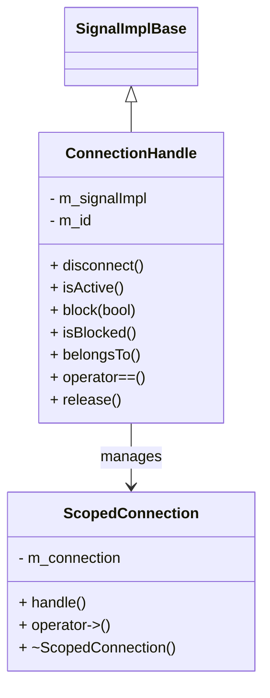

# Introduction

This document will walk you through the implementation of the <SwmToken path="/src/kdbindings/connection_handle.h" pos="23:2:2" line-data="class ConnectionHandle;">`ConnectionHandle`</SwmToken> in the <SwmToken path="/src/kdbindings/binding.h" pos="21:2:2" line-data="namespace KDBindings {">`KDBindings`</SwmToken> library. The <SwmToken path="/src/kdbindings/connection_handle.h" pos="23:2:2" line-data="class ConnectionHandle;">`ConnectionHandle`</SwmToken> is designed to manage connections between signals and slots, allowing for operations such as disconnecting, blocking, and checking the state of connections.

We will cover:

1. Why a virtual interface is used for signal implementation.
2. How <SwmToken path="/src/kdbindings/connection_handle.h" pos="23:2:2" line-data="class ConnectionHandle;">`ConnectionHandle`</SwmToken> manages connection states.
3. The role of <SwmToken path="/src/kdbindings/connection_handle.h" pos="267:5:5" line-data="     * A ScopedConnection can be constructed from a ConnectionHandle">`ScopedConnection`</SwmToken> in ensuring connections are properly managed.



# Virtual interface for signal implementation

<SwmSnippet path="/src/kdbindings/connection_handle.h" line="20">

---

The <SwmToken path="/src/kdbindings/connection_handle.h" pos="32:2:2" line-data="class SignalImplBase : public std::enable_shared_from_this&lt;SignalImplBase&gt;">`SignalImplBase`</SwmToken> class provides a virtual interface that the <SwmToken path="/src/kdbindings/connection_handle.h" pos="21:2:2" line-data="class Signal;">`Signal`</SwmToken> class must implement. This design allows <SwmToken path="/src/kdbindings/connection_handle.h" pos="23:2:2" line-data="class ConnectionHandle;">`ConnectionHandle`</SwmToken> to refer to a <SwmToken path="/src/kdbindings/connection_handle.h" pos="29:16:18" line-data="// It allows ConnectionHandle to refer to this non-template class, which then dispatches">`non-template`</SwmToken> class, enabling it to dispatch calls to the template implementation using virtual functions. This approach is crucial for maintaining a <SwmToken path="/src/kdbindings/connection_handle.h" pos="29:16:18" line-data="// It allows ConnectionHandle to refer to this non-template class, which then dispatches">`non-template`</SwmToken> <SwmToken path="/src/kdbindings/connection_handle.h" pos="23:2:2" line-data="class ConnectionHandle;">`ConnectionHandle`</SwmToken> class while leveraging template-based signal implementations.

```
template<typename... Args>
class Signal;

class ConnectionHandle;

namespace Private {
//
// This class defines a virtual interface, that the Signal this ConnectionHandle refers
// to must implement.
// It allows ConnectionHandle to refer to this non-template class, which then dispatches
// to the template implementation using virtual function calls.
// It allows ConnectionHandle to be a non-template class.
class SignalImplBase : public std::enable_shared_from_this<SignalImplBase>
{
public:
    SignalImplBase() = default;
```

---

</SwmSnippet>

# Managing connection states

The <SwmToken path="/src/kdbindings/connection_handle.h" pos="23:2:2" line-data="class ConnectionHandle;">`ConnectionHandle`</SwmToken> class is central to managing the state of connections. It provides methods to disconnect, check if a connection is active, block/unblock connections, and verify if a connection belongs to a specific signal. These functionalities are essential for controlling the lifecycle and behavior of signal-slot connections.

### Disconnecting connections

<SwmSnippet path="/src/kdbindings/connection_handle.h" line="76">

---

The <SwmToken path="/src/kdbindings/connection_handle.h" pos="91:3:3" line-data="    void disconnect() noexcept">`disconnect`</SwmToken> method is responsible for severing the connection between a signal and its slot. Once disconnected, the connection becomes inactive, and the associated slot will no longer be called when the signal is emitted.

```
    /**
     * Disconnect the slot.
     *
     * When this function is called, the function that was passed to Signal::connect
     * to create this ConnectionHandle will no longer be called when the Signal is emitted.
     *
     * If the ConnectionHandle is not active or the connection has already been disconnected,
     * nothing happens.
     *
     * After this call, the ConnectionHandle will be inactive (i.e. isActive() returns false)
     * and will no longer belong to any Signal (i.e. belongsTo returns false).
     *
     * @warning While this function is marked with noexcept, it *may* terminate the program
     * if it is not possible to allocate memory or if mutex locking isn't possible.
     **/
    void disconnect() noexcept
    {
        if (auto shared_impl = checkedLock()) {
            shared_impl->disconnect(*this);
        }
```

---

</SwmSnippet>

### Checking connection activity

<SwmSnippet path="/src/kdbindings/connection_handle.h" line="101">

---

The <SwmToken path="/src/kdbindings/connection_handle.h" pos="107:3:3" line-data="    bool isActive() const">`isActive`</SwmToken> method checks if the <SwmToken path="/src/kdbindings/connection_handle.h" pos="102:15:15" line-data="     * Check whether the connection of this ConnectionHandle is active.">`ConnectionHandle`</SwmToken> refers to an active signal connection. This is useful for determining whether operations on the connection can be performed.

```
    /**
     * Check whether the connection of this ConnectionHandle is active.
     *
     * @return true if the ConnectionHandle refers to an active Signal
     * and the connection was not disconnected previously, false otherwise.
     **/
    bool isActive() const
    {
        return static_cast<bool>(checkedLock());
    }
```

---

</SwmSnippet>

### Blocking connections

<SwmSnippet path="/src/kdbindings/connection_handle.h" line="112">

---

The <SwmToken path="/src/kdbindings/connection_handle.h" pos="113:7:7" line-data="     * Sets the block state of the connection.">`block`</SwmToken> method allows the connection to be temporarily blocked, preventing the slot from being called when the signal is emitted. This is useful for managing signal emissions during specific conditions.

```
    /**
     * Sets the block state of the connection.
     * If a connection is blocked, emitting the Signal will no longer call this
     * connections slot, until the connection is unblocked.
     *
     * Behaves the same as calling Signal::blockConnection with this
     * ConnectionHandle as argument.
     *
     * To temporarily block a connection, consider using an instance of ConnectionBlocker,
     * which offers a RAII-style implementation that makes sure the connection is always
     * returned to its original state.
     *
     * @param blocked The new blocked state of the connection.
     * @return whether the connection was previously blocked.
     * @throw std::out_of_range Throws if the connection is not active (i.e. isActive() returns false).
     **/
    bool block(bool blocked)
    {
        if (auto shared_impl = checkedLock()) {
            return shared_impl->blockConnection(*m_id, blocked);
        }
        throw std::out_of_range("Cannot block a non-active connection!");
    }
```

---

</SwmSnippet>

### Connection equality

<SwmSnippet path="/src/kdbindings/connection_handle.h" line="163">

---

The <SwmToken path="/src/kdbindings/connection_handle.h" pos="163:7:8" line-data="    // Define an operator== function to compare ConnectionHandle objects.">`operator==`</SwmToken> function compares two <SwmToken path="/src/kdbindings/connection_handle.h" pos="163:16:16" line-data="    // Define an operator== function to compare ConnectionHandle objects.">`ConnectionHandle`</SwmToken> objects to determine if they refer to the same connection. This is important for ensuring that operations are performed on the correct connection.

```
    // Define an operator== function to compare ConnectionHandle objects.
    bool operator==(const ConnectionHandle &other) const
    {
        auto thisSignalImpl = m_signalImpl.lock();
        auto otherSignalImpl = other.m_signalImpl.lock();
```

---

</SwmSnippet>

# Scoped connection management

The <SwmToken path="/src/kdbindings/connection_handle.h" pos="267:5:5" line-data="     * A ScopedConnection can be constructed from a ConnectionHandle">`ScopedConnection`</SwmToken> class provides a <SwmToken path="/src/kdbindings/connection_handle.h" pos="121:9:11" line-data="     * which offers a RAII-style implementation that makes sure the connection is always">`RAII-style`</SwmToken> mechanism to ensure that connections are properly disconnected when they go out of scope. This is particularly useful for managing the lifecycle of connections without manual intervention.

### Construction and assignment

<SwmSnippet path="/src/kdbindings/connection_handle.h" line="266">

---

The <SwmToken path="/src/kdbindings/connection_handle.h" pos="267:5:5" line-data="     * A ScopedConnection can be constructed from a ConnectionHandle">`ScopedConnection`</SwmToken> can be constructed and assigned using a <SwmToken path="/src/kdbindings/connection_handle.h" pos="267:17:17" line-data="     * A ScopedConnection can be constructed from a ConnectionHandle">`ConnectionHandle`</SwmToken>. This design ensures that the connection is automatically managed and disconnected when the <SwmToken path="/src/kdbindings/connection_handle.h" pos="267:5:5" line-data="     * A ScopedConnection can be constructed from a ConnectionHandle">`ScopedConnection`</SwmToken> is destructed.

```
    /**
     * A ScopedConnection can be constructed from a ConnectionHandle
     */
    ScopedConnection(ConnectionHandle &&h) noexcept
        : m_connection(std::move(h))
    {
    }
```

---

</SwmSnippet>

### Destructor behavior

<SwmSnippet path="/src/kdbindings/connection_handle.h" line="314">

---

The destructor of <SwmToken path="/src/kdbindings/connection_handle.h" pos="320:2:2" line-data="    ~ScopedConnection() noexcept">`ScopedConnection`</SwmToken> disconnects the connection it guards, ensuring that resources are released and the connection is properly terminated.

```
    /**
     * When a ConnectionHandle is destructed it disconnects the connection it guards.
     *
     * @warning While this function isn't marked as throwing, it *may* throw and terminate the program
     * if it is not possible to allocate memory or if mutex locking isn't possible.
     */
    ~ScopedConnection() noexcept
    {
        m_connection.disconnect();
    }
```

---

</SwmSnippet>

# Conclusion

The <SwmToken path="/src/kdbindings/connection_handle.h" pos="23:2:2" line-data="class ConnectionHandle;">`ConnectionHandle`</SwmToken> and <SwmToken path="/src/kdbindings/connection_handle.h" pos="267:5:5" line-data="     * A ScopedConnection can be constructed from a ConnectionHandle">`ScopedConnection`</SwmToken> classes are integral to managing signal-slot connections in the <SwmToken path="/src/kdbindings/binding.h" pos="21:2:2" line-data="namespace KDBindings {">`KDBindings`</SwmToken> library. By providing mechanisms for connection management, blocking, and automatic disconnection, these classes ensure robust and flexible handling of signal connections.

# Class diagram for connection handle

Below is a simplified class diagram representing the <SwmToken path="/src/kdbindings/connection_handle.h" pos="23:2:2" line-data="class ConnectionHandle;">`ConnectionHandle`</SwmToken> and <SwmToken path="/src/kdbindings/connection_handle.h" pos="267:5:5" line-data="     * A ScopedConnection can be constructed from a ConnectionHandle">`ScopedConnection`</SwmToken> classes:

```
+-------------------+
| ConnectionHandle  |
+-------------------+
| - m_signalImpl    |
| - m_id            |
+-------------------+
| + disconnect()    |
| + isActive()      |
| + block(bool)     |
| + isBlocked()     |
| + belongsTo()     |
| + operator==()    |
| + release()       |
+-------------------+

+-------------------+
| ScopedConnection  |
+-------------------+
| - m_connection    |
+-------------------+
| + handle()        |
| + operator->()    |
| + ~ScopedConnection() |
+-------------------+
```

This diagram illustrates the key attributes and methods of each class, highlighting their roles in connection management.

<SwmMeta version="3.0.0" repo-id="Z2l0aHViJTNBJTNBS0RCaW5kaW5ncyUzQSUzQUxvaXBmaW5nZXJN" repo-name="KDBindings"><sup>Powered by [Swimm](https://app.swimm.io/)</sup></SwmMeta>
