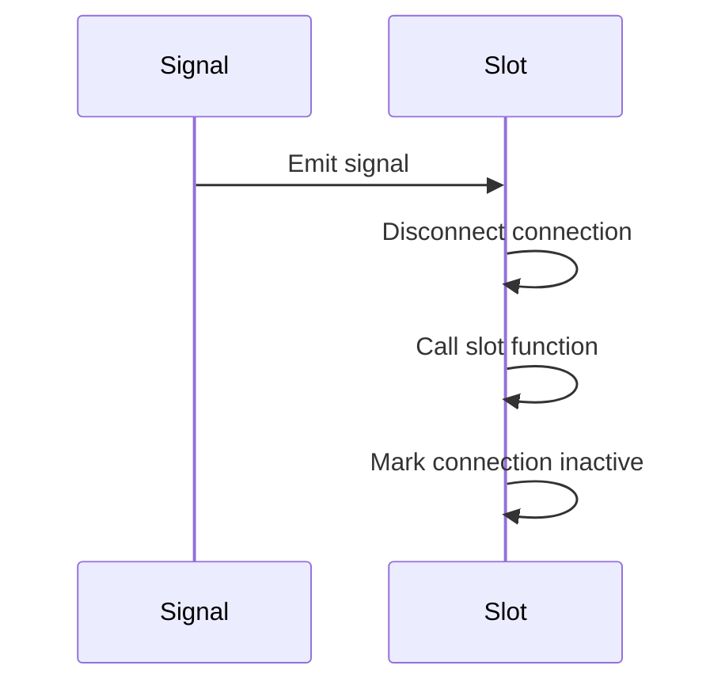
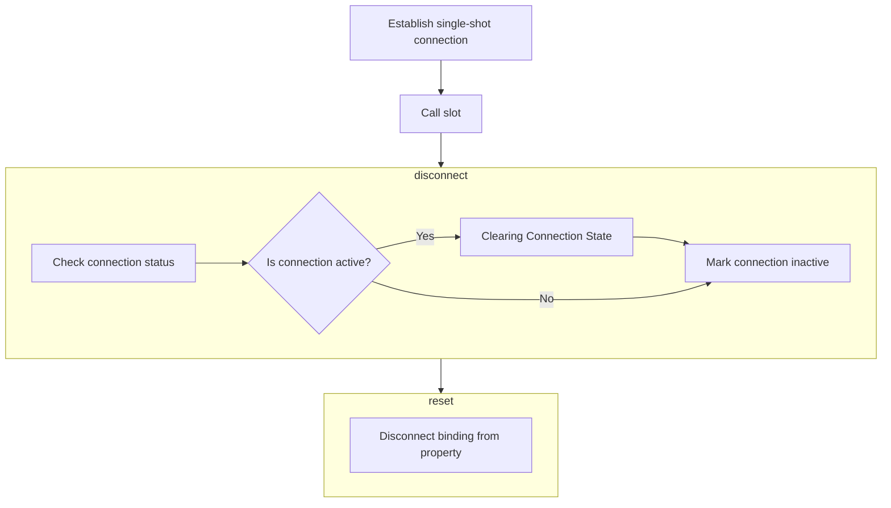
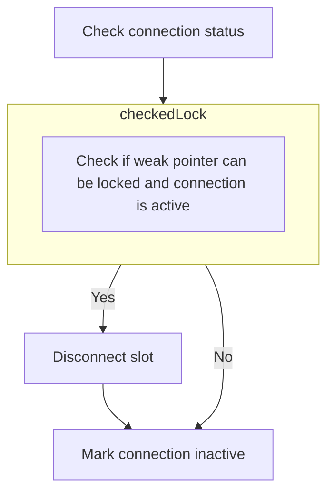

The `connectSingleShot` function establishes a one-time connection between a signal and a slot. When the signal is emitted, the connection is disconnected before the slot is called, ensuring the slot is only triggered once. This mechanism is useful for scenarios where a slot should only respond to a signal a single time, preventing repeated executions.

The main steps are:

- Establish a single-shot connection between a signal and a slot.
- Disconnect the connection before calling the slot.
- Call the slot function.
- Ensure the connection is inactive after the slot is called.



# Establishing a One-Time Signal-Slot Connection



<SwmSnippet path="/src/kdbindings/signal.h" line="366" repo-id="Z2l0aHViJTNBJTNBS0RCaW5kaW5ncyUzQSUzQUxvaXBmaW5nZXJN">

---

Here, we establish a single-shot connection between a signal and a slot. By calling disconnect before executing the slot, we ensure that the slot is only triggered once, even if the signal is emitted multiple times.

```c
     * Establishes a single-shot connection between a signal and a slot and when the signal is emitted, the connection will be
     * disconnected and the slot will be called. Note that the slot will be disconnected before it is called. If the slot
     * triggers another signal emission of the same signal, the slot will not be called again.
     *
     * @param slot A std::function that takes the signal's parameter types.
     * @return An instance of ConnectionHandle, that can be used to disconnect.
     *
     * @warning Connecting functions to a signal that throw an exception when called is currently undefined behavior.
     * All connected functions should handle their own exceptions.
     * For backwards-compatibility, the slot function is not required to be noexcept.
     */
    KDBINDINGS_WARN_UNUSED ConnectionHandle connectSingleShot(std::function<void(Args...)> const &slot)
    {
        return connectReflective([slot](ConnectionHandle &handle, Args... args) {
            handle.disconnect();
```

---

</SwmSnippet>

## Terminating the Signal-Slot Connection



<SwmSnippet path="/src/kdbindings/connection_handle.h" line="77" repo-id="Z2l0aHViJTNBJTNBS0RCaW5kaW5ncyUzQSUzQUxvaXBmaW5nZXJN">

---

Next, the disconnect function terminates the connection between a signal and its slot. By calling checkedLock, it ensures the connection is still valid and active before proceeding with the disconnection, preventing any undefined behavior or errors.

```c
     * Disconnect the slot.
     *
     * When this function is called, the function that was passed to Signal::connect
     * to create this ConnectionHandle will no longer be called when the Signal is emitted.
     *
     * If the ConnectionHandle is not active or the connection has already been disconnected,
     * nothing happens.
     *
     * After this call, the ConnectionHandle will be inactive (i.e. isActive() returns false)
     * and will no longer belong to any Signal (i.e. belongsTo returns false).
     *
     * @warning While this function is marked with noexcept, it *may* terminate the program
     * if it is not possible to allocate memory or if mutex locking isn't possible.
     **/
    void disconnect() noexcept
    {
        if (auto shared_impl = checkedLock()) {
```

---

</SwmSnippet>

### Verifying Connection Validity

<SwmSnippet path="/src/kdbindings/connection_handle.h" line="217" repo-id="Z2l0aHViJTNBJTNBS0RCaW5kaW5ncyUzQSUzQUxvaXBmaW5nZXJN">

---

Here, checkedLock verifies the validity and activity of a connection by attempting to lock the weak pointer. By calling lock, it obtains a shared pointer to the connection implementation, confirming the connection's validity and activity.

```c
    // Checks that the weak_ptr can be locked and that the connection is
    // still active
    std::shared_ptr<Private::SignalImplBase> checkedLock() const noexcept
    {
        if (m_id.has_value()) {
            auto shared_impl = m_signalImpl.lock();
```

---

</SwmSnippet>

### Executing Disconnection Logic

<SwmSnippet path="/src/kdbindings/connection_handle.h" line="94" repo-id="Z2l0aHViJTNBJTNBS0RCaW5kaW5ncyUzQSUzQUxvaXBmaW5nZXJN">

---

Back in disconnect, after returning from checkedLock, we call SignalImplBase::disconnect to ensure that the connection is terminated, and the slot will no longer be triggered by the signal, achieving the goal of disconnecting the slot.

```c
            shared_impl->disconnect(*this);
        }

```

---

</SwmSnippet>

### Finalizing Disconnection

<SwmSnippet path="/src/kdbindings/connection_handle.h" line="97" repo-id="Z2l0aHViJTNBJTNBS0RCaW5kaW5ncyUzQSUzQUxvaXBmaW5nZXJN">

---

Back in disconnect, after returning from SignalImplBase::disconnect, we call reset to ensure that the connection handle is completely inactive and does not belong to any signal, preventing accidental reconnections or memory leaks.

```c
        // ConnectionHandle is no longer active;
        m_signalImpl.reset();
    }
```

---

</SwmSnippet>

## Clearing Connection State

<SwmSnippet path="/src/kdbindings/property.h" line="271" repo-id="Z2l0aHViJTNBJTNBS0RCaW5kaW5ncyUzQSUzQUxvaXBmaW5nZXJN">

---

Finally, reset clears the internal state of the property or connection handle, removing any existing bindings or connections.

```c
     * @brief Disconnects the binding from this Property
     *
     * If this Property has a binding, it will no longer update it.
     * Otherwise, this function does nothing.
     *
     * The value of the property does not change when it is reset.
     */
    void reset()
    {
        m_updater.reset();
    }
```

---

</SwmSnippet>

## Completing Single-Shot Connection

<SwmSnippet path="/src/kdbindings/signal.h" line="379" repo-id="Z2l0aHViJTNBJTNBS0RCaW5kaW5ncyUzQSUzQUxvaXBmaW5nZXJN">

---

Back in connectSingleShot, after returning from disconnect, we call connectReflective to ensure that the slot has the necessary tools to manage its connection, achieving the goal of a flexible and self-managing connection.

```c
        return connectReflective([slot](ConnectionHandle &handle, Args... args) {
            handle.disconnect();
            slot(args...);
        });
    }
```

---

</SwmSnippet>

# Establishing Reflective Connection

<SwmSnippet path="/src/kdbindings/signal.h" line="345" repo-id="Z2l0aHViJTNBJTNBS0RCaW5kaW5ncyUzQSUzQUxvaXBmaW5nZXJN">

---

This is the implementation of connectReflective, establishing a connection where the slot can manage its own connection handle. By calling ensureImpl, we ensure that the signal implementation is ready and available, allowing us to safely establish the connection and provide the slot with the necessary tools to manage its connection state.

```c
     * Establishes a connection between a signal and a slot, allowing the slot to access and manage its own connection handle.
     * This method is particularly useful for creating connections that can autonomously manage themselves, such as disconnecting
     * after being triggered a certain number of times or under specific conditions. It wraps the given slot function
     * to include a reference to the ConnectionHandle as the first parameter, enabling the slot to interact with
     * its own connection state directly.
     *
     * @param slot A std::function that takes a ConnectionHandle reference followed by the signal's parameter types.
     * @return A ConnectionHandle to the newly established connection, allowing for advanced connection management.
     *
     * @warning Connecting functions to a signal that throw an exception when called is currently undefined behavior.
     * All connected functions should handle their own exceptions.
     * For backwards-compatibility, the slot function is not required to be noexcept.
     */
    KDBINDINGS_WARN_UNUSED ConnectionHandle connectReflective(std::function<void(ConnectionHandle &, Args...)> const &slot)
    {
        ensureImpl();

```

---

</SwmSnippet>

<SwmSnippet path="/src/kdbindings/signal.h" line="579" repo-id="Z2l0aHViJTNBJTNBS0RCaW5kaW5ncyUzQSUzQUxvaXBmaW5nZXJN">

---

Here, we initialize the signal implementation if it is not already initialized by creating a new shared pointer to an implementation object.

```c
    void ensureImpl()
    {
        if (!m_impl) {
            m_impl = std::make_shared<Impl>();
        }
    }
```

---

</SwmSnippet>

# Inserting Reflective Connection

<SwmSnippet path="/src/kdbindings/signal.h" line="129" repo-id="Z2l0aHViJTNBJTNBS0RCaW5kaW5ncyUzQSUzQUxvaXBmaW5nZXJN">

---

Finally, we add the new reflective connection to the signal's connection list by calling insert, ensuring that the connection is properly tracked and can be managed by the signal's connection handling mechanisms.

```c
        Private::GenerationalIndex connectReflective(std::function<void(ConnectionHandle &handle, Args...)> const &slot)
        {
            Connection newConnection;
            newConnection.slotReflective = slot;

            return m_connections.insert(std::move(newConnection));
        }
```

---

</SwmSnippet>

# Allocating Connection Index

<SwmSnippet path="/src/kdbindings/genindex_array.h" line="136" repo-id="Z2l0aHViJTNBJTNBS0RCaW5kaW5ncyUzQSUzQUxvaXBmaW5nZXJN">

---

Here, we add a new connection to the signal's connection list by calling allocate to find the first available index, ensuring that the new connection is properly indexed and can be managed by the signal's connection handling mechanisms.

```c
    // Insert a value at the first free index and get the index back
    GenerationalIndex insert(T &&value)
    {
        const auto index = m_allocator.allocate();
```

---

</SwmSnippet>

<SwmSnippet path="/src/kdbindings/genindex_array.h" line="57" repo-id="Z2l0aHViJTNBJTNBS0RCaW5kaW5ncyUzQSUzQUxvaXBmaW5nZXJN">

---

Next, we find the first available index in the connection list, using free indices if available, and update the generation count for the index.

```c
    GenerationalIndex allocate()
    {
        if (m_freeIndices.size() > 0) {
            uint32_t index = m_freeIndices.back();
            m_freeIndices.pop_back();

            m_entries[index].generation += 1;
            m_entries[index].isLive = true;

            return { index, m_entries[index].generation };
        } else {
            // check that we are still within the bounds of uint32_t
            // (parentheses added to avoid Windows min/max macros)
            if (m_entries.size() + 1 >= (std::numeric_limits<uint32_t>::max)()) {
                throw std::length_error(std::string("Maximum number of values inside GenerationalIndexArray reached: ") + std::to_string(m_entries.size()));
            }

            m_entries.push_back({ true, 0 });
            return { static_cast<uint32_t>(m_entries.size()) - 1, 0 };
        }
    }
```

---

</SwmSnippet>

<SwmSnippet path="/src/kdbindings/genindex_array.h" line="140" repo-id="Z2l0aHViJTNBJTNBS0RCaW5kaW5ncyUzQSUzQUxvaXBmaW5nZXJN">

---

Back in insert, after returning from allocate, we call set to ensure that the connection is properly stored in the connection list and can be managed by the signal's connection handling mechanisms, finalizing the insertion process.

```c
        set(index, std::move(value));
        return index;
    }
```

---

</SwmSnippet>

<SwmSnippet path="/src/kdbindings/genindex_array.h" line="117" repo-id="Z2l0aHViJTNBJTNBS0RCaW5kaW5ncyUzQSUzQUxvaXBmaW5nZXJN">

---

Here, we assign a new connection to a specific index in the connection list, expanding the list if necessary to accommodate the index.

```c
    // Sets the value at a specific index inside the array
    void set(const GenerationalIndex index, T &&value)
    {
        while (m_entries.size() <= index.index)
            m_entries.emplace_back(std::nullopt);
```

---

</SwmSnippet>

<SwmSnippet path="/src/kdbindings/genindex_array.h" line="121" repo-id="Z2l0aHViJTNBJTNBS0RCaW5kaW5ncyUzQSUzQUxvaXBmaW5nZXJN">

---

Finally, set modifies the internal state of the connection list by assigning a new connection to a specific index, completing the insertion process.

```c
            m_entries.emplace_back(std::nullopt);

#ifndef NDEBUG
        uint32_t previousGeneration = 0;

        const auto &previousEntry = m_entries[index.index];
        if (previousEntry)
            previousGeneration = previousEntry->generation;

        assert(index.generation >= previousGeneration);
#endif

        m_entries[index.index] = std::optional<Entry>{ { index.generation, std::move(value) } };
    }
```

---

</SwmSnippet>

&nbsp;

*This is an auto-generated document by Swimm 🌊 and has not yet been verified by a human*

<SwmMeta version="3.0.0"><sup>Powered by [Swimm](https://staging.swimm.cloud/)</sup></SwmMeta>
