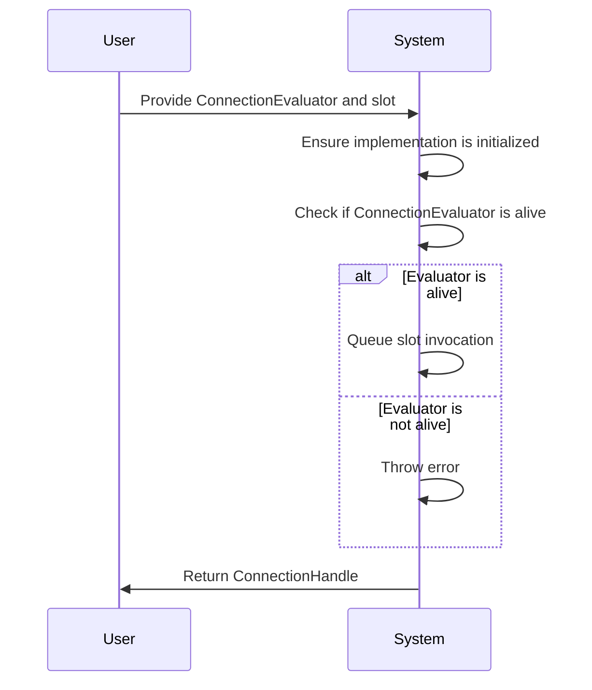
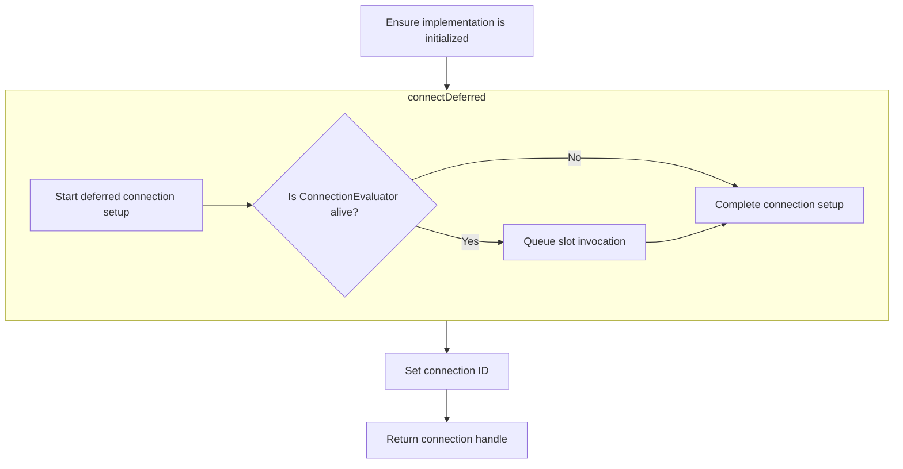
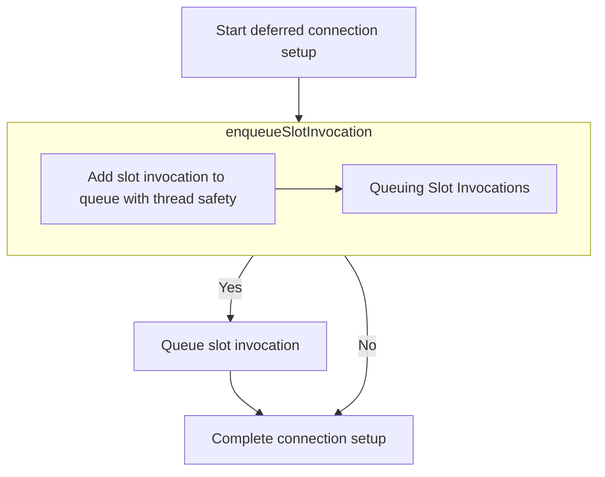

This document describes the process of establishing a deferred connection between a ConnectionEvaluator and a slot. The flow ensures that the implementation is initialized and manages the execution of the slot based on the evaluator's conditions. For example, if a ConnectionEvaluator is provided with a condition to execute a slot when a certain event occurs, the flow will return a ConnectionHandle that can be used to manage this connection.

The main steps are:

- Ensure the implementation is initialized.
- Check if the ConnectionEvaluator is alive.
- Queue the slot invocation if the evaluator is valid.
- Throw an error if the evaluator is not alive.
- Set the connection ID and return the connection handle.



# Establishing Deferred Connections



<SwmSnippet path="/src/kdbindings/signal.h" line="386" repo-id="Z2l0aHViJTNBJTNBS0RCaW5kaW5ncyUzQSUzQUxvaXBmaW5nZXJN">

---

Here, connectDeferred sets up a deferred connection between an evaluator and a slot, ensuring the implementation is initialized by calling ensureImpl, which is necessary for the deferred connection to function correctly.

```c
     * @brief Establishes a deferred connection between the provided evaluator and slot.
     *
     * @warning Deferred connections are experimental and may be removed or changed in the future.
     *
     * This function allows connecting an evaluator and a slot such that the slot's execution
     * is deferred until the conditions evaluated by the `evaluator` are met.
     *
     * First argument to the function is reference to a shared pointer to the ConnectionEvaluator responsible for determining
     * when the slot should be executed.
     *
     * @return An instance of ConnectionHandle, that can be used to disconnect
     * or temporarily block the connection.
     *
     * @note
     * The Signal class itself is not thread-safe. While the ConnectionEvaluator is inherently
     * thread-safe, ensure that any concurrent access to this Signal is protected externally to maintain thread safety.
     *
     * @warning Connecting functions to a signal that throw an exception when called is currently undefined behavior.
     * All connected functions should handle their own exceptions.
     * For backwards-compatibility, the slot function is not required to be noexcept.
     */
    KDBINDINGS_WARN_UNUSED ConnectionHandle connectDeferred(const std::shared_ptr<ConnectionEvaluator> &evaluator, std::function<void(Args...)> const &slot)
    {
        ensureImpl();

```

---

</SwmSnippet>

<SwmSnippet path="/src/kdbindings/signal.h" line="579" repo-id="Z2l0aHViJTNBJTNBS0RCaW5kaW5ncyUzQSUzQUxvaXBmaW5nZXJN">

---

First, it checks and initializes the implementation by creating a shared instance of Impl if needed, which is essential to ensure that the deferred connection can be established without issues.

```c
    void ensureImpl()
    {
        if (!m_impl) {
            m_impl = std::make_shared<Impl>();
        }
    }
```

---

</SwmSnippet>

<SwmSnippet path="/src/kdbindings/signal.h" line="411" repo-id="Z2l0aHViJTNBJTNBS0RCaW5kaW5ncyUzQSUzQUxvaXBmaW5nZXJN">

---

Back in connectDeferred, we create a ConnectionHandle and set its ID using the connectDeferred method, associating the evaluator and slot with the implementation, which allows the deferred connection to be managed and manipulated through the ConnectionHandle.

```c
        ConnectionHandle handle(m_impl, {});
        handle.setId(m_impl->connectDeferred(evaluator, slot));
```

---

</SwmSnippet>

## Managing Deferred Slot Execution



<SwmSnippet path="/src/kdbindings/signal.h" line="104" repo-id="Z2l0aHViJTNBJTNBS0RCaW5kaW5ncyUzQSUzQUxvaXBmaW5nZXJN">

---

Next, connectDeferred manages deferred slot execution using a weak pointer to the evaluator and calls lock to ensure the evaluator is valid before executing the slot, preventing potential errors due to invalid evaluators.

```c
        // Establish a deferred connection between signal and slot, where ConnectionEvaluator object
        // is used to queue all the connection to evaluate later. The returned
        // value can be used to disconnect the slot later.
        Private::GenerationalIndex connectDeferred(const std::shared_ptr<ConnectionEvaluator> &evaluator, std::function<void(Args...)> const &slot)
        {
            auto weakEvaluator = std::weak_ptr<ConnectionEvaluator>(evaluator);

            auto deferredSlot = [weakEvaluator = std::move(weakEvaluator), slot](ConnectionHandle &handle, Args... args) {
                if (auto evaluatorPtr = weakEvaluator.lock()) {
```

---

</SwmSnippet>

<SwmSnippet path="/src/kdbindings/signal.h" line="113" repo-id="Z2l0aHViJTNBJTNBS0RCaW5kaW5ncyUzQSUzQUxvaXBmaW5nZXJN">

---

Back in connectDeferred, we define a lambda for slot execution and call enqueueSlotInvocation to queue the slot invocation for deferred execution, allowing the evaluator to manage when the slot should be executed based on its conditions.

```c
                    auto lambda = [slot, args...]() {
                        slot(args...);
                    };
                    evaluatorPtr->enqueueSlotInvocation(handle, lambda);
```

---

</SwmSnippet>

### Queuing Slot Invocations

<SwmSnippet path="/src/kdbindings/connection_evaluator.h" line="114" repo-id="Z2l0aHViJTNBJTNBS0RCaW5kaW5ncyUzQSUzQUxvaXBmaW5nZXJN">

---

Here, enqueueSlotInvocation adds the slot invocation to a queue with thread safety and calls onInvocationAdded, allowing subclasses to perform additional actions when a new invocation is added, such as waking up an event loop.

```c
    void enqueueSlotInvocation(const ConnectionHandle &handle, const std::function<void()> &slotInvocation)
    {
        {
            std::lock_guard<std::recursive_mutex> lock(m_slotInvocationMutex);
            m_deferredSlotInvocations.push_back({ handle, std::move(slotInvocation) });
        }
        onInvocationAdded();
    }
```

---

</SwmSnippet>

### Handling Invocation Notifications

<SwmSnippet path="/src/kdbindings/connection_evaluator.h" line="94" repo-id="Z2l0aHViJTNBJTNBS0RCaW5kaW5ncyUzQSUzQUxvaXBmaW5nZXJN">

---

This function returns nothing but provides a hook for subclasses to implement custom behavior when a new invocation is added, such as waking up an event loop or synchronizing threads.

```c
     * @brief Called when a new slot invocation is added.
     *
     * This function can be overwritten by subclasses to get notified whenever a new invocation is added to this evaluator.
     * The default implementation does nothing and does not have to be called by subclasses when overriding.
     *
     * ⚠️  *Note that this function will be executed on the thread that enqueued the slot invocation (i.e. the thread that called .emit() on the signal),
     * which is usually not the thread that is responsible for evaluating the connections!
     * Therefore it is usually not correct to call evaluateDeferredConnections() within this function!
     * User code is responsible for ensuring that the threads are synchronized correctly.*
     *
     * For example, if you plan to evaluate (execute) the slot invocations in some "main" thread A
     * and a signal is emitted in thread B, than this method will be called on thread B.
     * It is a good place to "wake up" the event loop of thread A so that thread A can call `evaluateDeferredConnections()`.
     */
    virtual void onInvocationAdded() { }
```

---

</SwmSnippet>

### Finalizing Deferred Connections

<SwmSnippet path="/src/kdbindings/signal.h" line="117" repo-id="Z2l0aHViJTNBJTNBS0RCaW5kaW5ncyUzQSUzQUxvaXBmaW5nZXJN">

---

Back in connectDeferred, we create a new Connection object and insert it into the connections list to store connection details for management, allowing the deferred connection to be managed and referenced later.

```c
                } else {
                    throw std::runtime_error("ConnectionEvaluator is no longer alive");
                }
            };

            Connection newConnection;
            newConnection.m_connectionEvaluator = evaluator;
            newConnection.slotReflective = deferredSlot;

            return m_connections.insert(std::move(newConnection));
        }
```

---

</SwmSnippet>

## Storing Connection Details

<SwmSnippet path="/src/kdbindings/genindex_array.h" line="136" repo-id="Z2l0aHViJTNBJTNBS0RCaW5kaW5ncyUzQSUzQUxvaXBmaW5nZXJN">

---

First, insert stores a new connection in the array by calling allocate to find the first free index, efficiently managing storage without overwriting existing ones.

```c
    // Insert a value at the first free index and get the index back
    GenerationalIndex insert(T &&value)
    {
        const auto index = m_allocator.allocate();
```

---

</SwmSnippet>

<SwmSnippet path="/src/kdbindings/genindex_array.h" line="57" repo-id="Z2l0aHViJTNBJTNBS0RCaW5kaW5ncyUzQSUzQUxvaXBmaW5nZXJN">

---

Next, it finds a free index or expands the array, updating generation and marking the index as live, ensuring that the index is ready for storing new connection details.

```c
    GenerationalIndex allocate()
    {
        if (m_freeIndices.size() > 0) {
            uint32_t index = m_freeIndices.back();
            m_freeIndices.pop_back();

            m_entries[index].generation += 1;
            m_entries[index].isLive = true;

            return { index, m_entries[index].generation };
        } else {
            // check that we are still within the bounds of uint32_t
            // (parentheses added to avoid Windows min/max macros)
            if (m_entries.size() + 1 >= (std::numeric_limits<uint32_t>::max)()) {
                throw std::length_error(std::string("Maximum number of values inside GenerationalIndexArray reached: ") + std::to_string(m_entries.size()));
            }

            m_entries.push_back({ true, 0 });
            return { static_cast<uint32_t>(m_entries.size()) - 1, 0 };
        }
    }
```

---

</SwmSnippet>

<SwmSnippet path="/src/kdbindings/genindex_array.h" line="140" repo-id="Z2l0aHViJTNBJTNBS0RCaW5kaW5ncyUzQSUzQUxvaXBmaW5nZXJN">

---

Back in insert, we call set to store connection details at the allocated index, ensuring correct placement in the array, allowing them to be accessed and managed later.

```c
        set(index, std::move(value));
        return index;
    }
```

---

</SwmSnippet>

<SwmSnippet path="/src/kdbindings/genindex_array.h" line="117" repo-id="Z2l0aHViJTNBJTNBS0RCaW5kaW5ncyUzQSUzQUxvaXBmaW5nZXJN">

---

Finally, it places connection details at the specified index, expanding the array if necessary, ensuring index readiness for holding the new data.

```c
    // Sets the value at a specific index inside the array
    void set(const GenerationalIndex index, T &&value)
    {
        while (m_entries.size() <= index.index)
            m_entries.emplace_back(std::nullopt);
```

---

</SwmSnippet>

<SwmSnippet path="/src/kdbindings/genindex_array.h" line="121" repo-id="Z2l0aHViJTNBJTNBS0RCaW5kaW5ncyUzQSUzQUxvaXBmaW5nZXJN">

---

This function returns nothing but ensures correct placement of connection details in the array, which is crucial for accessing and managing the connection details later.

```c
            m_entries.emplace_back(std::nullopt);

#ifndef NDEBUG
        uint32_t previousGeneration = 0;

        const auto &previousEntry = m_entries[index.index];
        if (previousEntry)
            previousGeneration = previousEntry->generation;

        assert(index.generation >= previousGeneration);
#endif

        m_entries[index.index] = std::optional<Entry>{ { index.generation, std::move(value) } };
    }
```

---

</SwmSnippet>

## Completing Connection Setup

<SwmSnippet path="/src/kdbindings/signal.h" line="412" repo-id="Z2l0aHViJTNBJTNBS0RCaW5kaW5ncyUzQSUzQUxvaXBmaW5nZXJN">

---

Back in connectDeferred, we set the ID of the ConnectionHandle using setId, associating the handle with connection details, allowing the connection to be managed through the handle.

```c
        handle.setId(m_impl->connectDeferred(evaluator, slot));
        return handle;
    }
```

---

</SwmSnippet>

<SwmSnippet path="/src/kdbindings/connection_handle.h" line="212" repo-id="Z2l0aHViJTNBJTNBS0RCaW5kaW5ncyUzQSUzQUxvaXBmaW5nZXJN">

---

Here, it assigns the ID to the ConnectionHandle, linking it to connection details, which is crucial for managing the connection.

```c
    void setId(const Private::GenerationalIndex &id)
    {
        m_id = id;
    }
```

---

</SwmSnippet>

&nbsp;

*This is an auto-generated document by Swimm 🌊 and has not yet been verified by a human*

<SwmMeta version="3.0.0"><sup>Powered by [Swimm](https://staging.swimm.cloud/)</sup></SwmMeta>
