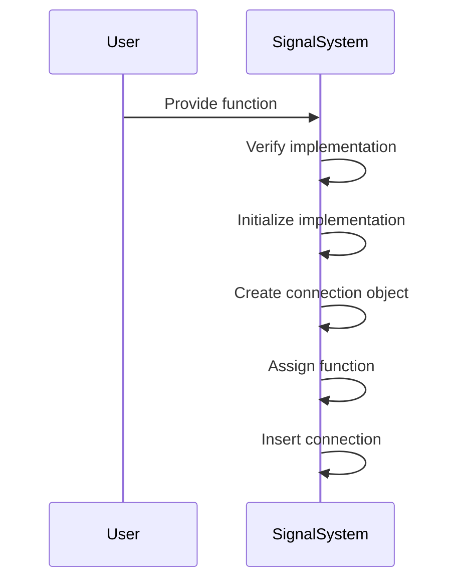
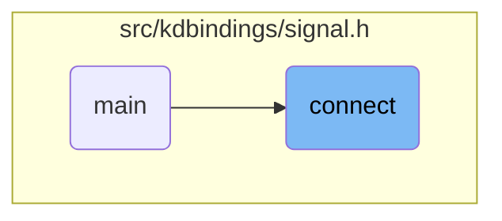
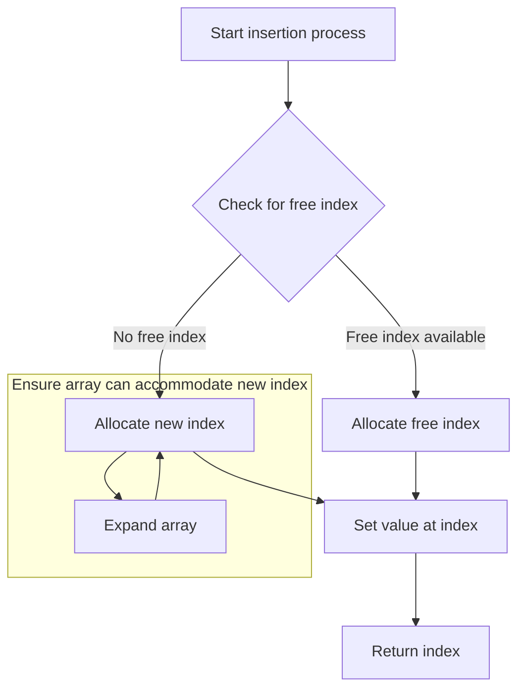

The connect flow establishes a connection between a function and a signal, enabling the function to be called when the signal is emitted. This process involves verifying and initializing the implementation object, creating a connection object, assigning the function to it, and inserting the connection to obtain an index for management. For example, you can connect a logging function to a signal that emits when data is updated. The output is a ConnectionHandle that can be used to disconnect the logging function later.

The main steps are:

- Verify the implementation object exists.
- Initialize the implementation if necessary.
- Create a new connection object.
- Assign the provided function to the connection.
- Insert the connection and obtain an index.



# Where is this flow used?

This flow is used multiple times in the codebase as represented in the following diagram:



# Establishing Signal Connections

<SwmSnippet path="/src/kdbindings/signal.h" line="325" repo-id="Z2l0aHViJTNBJTNBS0RCaW5kaW5ncyUzQSUzQUxvaXBmaW5nZXJN">

---

Here, the connect function is responsible for linking a std::function to a signal. We call ensureImpl to verify that the implementation object exists, which is crucial for managing connections effectively.

```c
     * Connects a std::function to the signal.
     *
     * When emit() is called on the Signal, the functions will be called with
     * the arguments provided to emit().
     *
     * @return An instance of ConnectionHandle, that can be used to disconnect
     * or temporarily block the connection.
     *
     * @warning Connecting functions to a signal that throw an exception when called is currently undefined behavior.
     * All connected functions should handle their own exceptions.
     * For backwards-compatibility, the slot function is not required to be noexcept.
     */
    KDBINDINGS_WARN_UNUSED ConnectionHandle connect(std::function<void(Args...)> const &slot)
    {
        ensureImpl();

```

---

</SwmSnippet>

<SwmSnippet path="/src/kdbindings/signal.h" line="579" repo-id="Z2l0aHViJTNBJTNBS0RCaW5kaW5ncyUzQSUzQUxvaXBmaW5nZXJN">

---

Next, we check if the implementation pointer is null and initialize it using std::make_shared if needed, ensuring the infrastructure for managing connections is ready before making any connections.

```c
    void ensureImpl()
    {
        if (!m_impl) {
            m_impl = std::make_shared<Impl>();
        }
    }
```

---

</SwmSnippet>

# Finalizing Signal Connection

<SwmSnippet path="/src/kdbindings/signal.h" line="95" repo-id="Z2l0aHViJTNBJTNBS0RCaW5kaW5ncyUzQSUzQUxvaXBmaW5nZXJN">

---

Finally, we create a new connection object, assign the provided slot function to it, and call insert to obtain an index that allows us to manage the connection later, such as disconnecting or blocking it.

```c
        // Connects a std::function to the signal. The returned
        // value can be used to disconnect the function again.
        Private::GenerationalIndex connect(std::function<void(Args...)> const &slot)
        {
            Connection newConnection;
            newConnection.slot = slot;
            return m_connections.insert(std::move(newConnection));
        }
```

---

</SwmSnippet>

# Managing Connection Indices



<SwmSnippet path="/src/kdbindings/genindex_array.h" line="136" repo-id="Z2l0aHViJTNBJTNBS0RCaW5kaW5ncyUzQSUzQUxvaXBmaW5nZXJN">

---

First, we manage indices for connections by calling allocate to find a suitable index, ensuring we efficiently manage storage and do not run out of indices.

```c
    // Insert a value at the first free index and get the index back
    GenerationalIndex insert(T &&value)
    {
        const auto index = m_allocator.allocate();
```

---

</SwmSnippet>

<SwmSnippet path="/src/kdbindings/genindex_array.h" line="57" repo-id="Z2l0aHViJTNBJTNBS0RCaW5kaW5ncyUzQSUzQUxvaXBmaW5nZXJN">

---

Next, we allocate an index for a new connection by reusing free indices if available or adding new entries, ensuring efficient index management and preventing exceeding limits.

```c
    GenerationalIndex allocate()
    {
        if (m_freeIndices.size() > 0) {
            uint32_t index = m_freeIndices.back();
            m_freeIndices.pop_back();

            m_entries[index].generation += 1;
            m_entries[index].isLive = true;

            return { index, m_entries[index].generation };
        } else {
            // check that we are still within the bounds of uint32_t
            // (parentheses added to avoid Windows min/max macros)
            if (m_entries.size() + 1 >= (std::numeric_limits<uint32_t>::max)()) {
                throw std::length_error(std::string("Maximum number of values inside GenerationalIndexArray reached: ") + std::to_string(m_entries.size()));
            }

            m_entries.push_back({ true, 0 });
            return { static_cast<uint32_t>(m_entries.size()) - 1, 0 };
        }
    }
```

---

</SwmSnippet>

<SwmSnippet path="/src/kdbindings/genindex_array.h" line="140" repo-id="Z2l0aHViJTNBJTNBS0RCaW5kaW5ncyUzQSUzQUxvaXBmaW5nZXJN">

---

Back from allocate, we finalize insertion by calling set to store the connection at the allocated index, ensuring it is properly recorded and can be managed effectively later.

```c
        set(index, std::move(value));
        return index;
    }
```

---

</SwmSnippet>

<SwmSnippet path="/src/kdbindings/genindex_array.h" line="117" repo-id="Z2l0aHViJTNBJTNBS0RCaW5kaW5ncyUzQSUzQUxvaXBmaW5nZXJN">

---

We start by setting the value at a specific index, expanding the array if necessary to ensure the connection can be stored without causing errors.

```c
    // Sets the value at a specific index inside the array
    void set(const GenerationalIndex index, T &&value)
    {
        while (m_entries.size() <= index.index)
            m_entries.emplace_back(std::nullopt);
```

---

</SwmSnippet>

<SwmSnippet path="/src/kdbindings/genindex_array.h" line="121" repo-id="Z2l0aHViJTNBJTNBS0RCaW5kaW5ncyUzQSUzQUxvaXBmaW5nZXJN">

---

Finally, the connection is stored at the specified index with its generation number, ensuring it is uniquely identified and managed correctly.

```c
            m_entries.emplace_back(std::nullopt);

#ifndef NDEBUG
        uint32_t previousGeneration = 0;

        const auto &previousEntry = m_entries[index.index];
        if (previousEntry)
            previousGeneration = previousEntry->generation;

        assert(index.generation >= previousGeneration);
#endif

        m_entries[index.index] = std::optional<Entry>{ { index.generation, std::move(value) } };
    }
```

---

</SwmSnippet>

&nbsp;

*This is an auto-generated document by Swimm 🌊 and has not yet been verified by a human*

<SwmMeta version="3.0.0"><sup>Powered by [Swimm](https://app.swimm.io/)</sup></SwmMeta>
