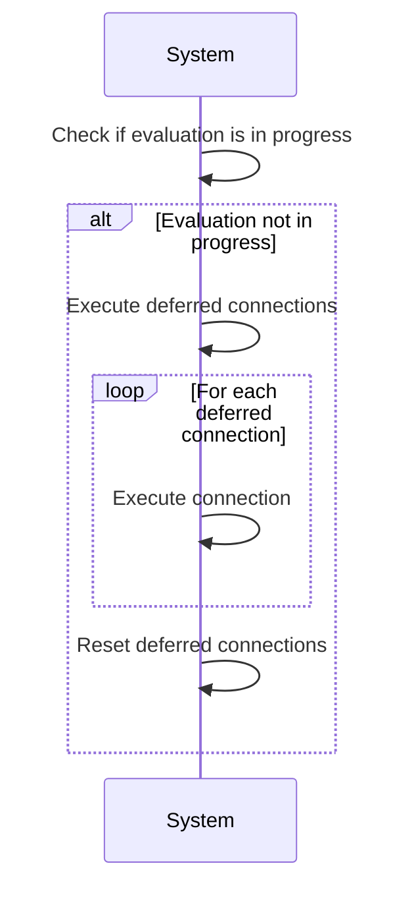
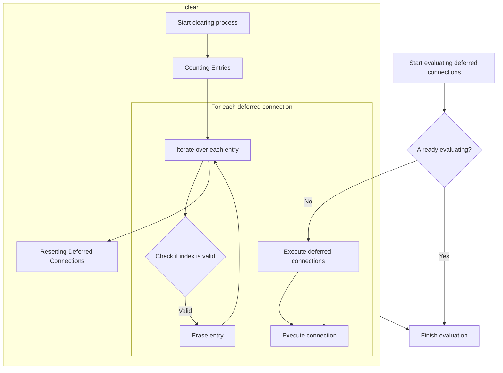
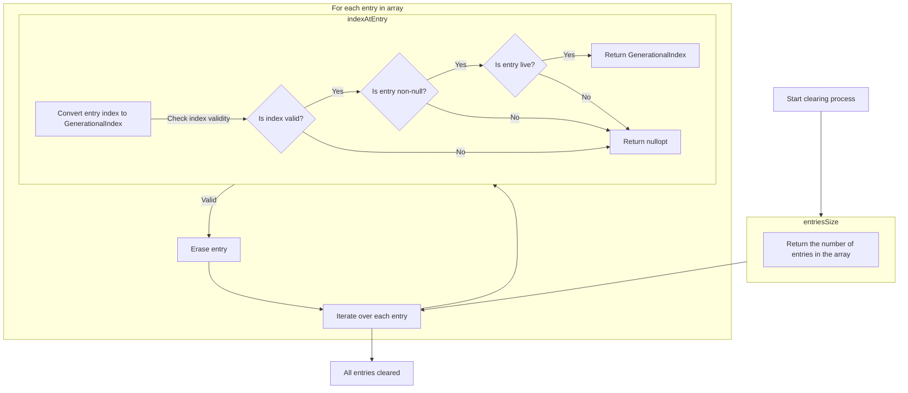
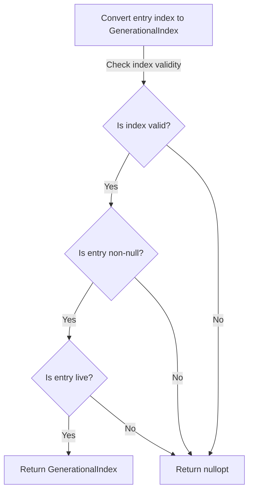

The document describes the process of evaluating deferred connections, ensuring that connections are executed and reset properly to maintain the system's responsiveness and functionality.

The main steps are:

- Check if evaluation is already in progress
- Execute deferred connections
- Reset deferred connections



# Evaluating Deferred Connections



<SwmSnippet path="/src/kdbindings/connection_evaluator.h" line="57" repo-id="Z2l0aHViJTNBJTNBS0RCaW5kaW5ncyUzQSUzQUxvaXBmaW5nZXJN">

---

Here, we lock the mutex to ensure thread safety, check if evaluation is already in progress to prevent re-entrance, and execute each deferred connection.

```c
     * @brief Evaluate the deferred connections.
     *
     * This function is responsible for evaluating and executing deferred connections.
     * This function is thread safe.
     *
     * @warning Evaluating slots that throw an exception is currently undefined behavior.
     */
    void evaluateDeferredConnections()
    {
        std::lock_guard<std::recursive_mutex> lock(m_slotInvocationMutex);

        if (m_isEvaluating) {
            // We're already evaluating, so we don't want to re-enter this function.
            return;
        }
        m_isEvaluating = true;

        // Current best-effort error handling will remove any further invocations that were queued.
        // We could use a queue and use a `while(!empty) { pop_front() }` loop instead to avoid this.
        // However, we would then ideally use a ring-buffer to avoid excessive allocations, which isn't in the STL.
        try {
            for (auto &pair : m_deferredSlotInvocations) {
                pair.second();
            }
```

---

</SwmSnippet>

<SwmSnippet path="/src/kdbindings/connection_evaluator.h" line="82" repo-id="Z2l0aHViJTNBJTNBS0RCaW5kaW5ncyUzQSUzQUxvaXBmaW5nZXJN">

---

Next, we clear m_deferredSlotInvocations to reset the state and ensure that any further invocations that were queued are removed, thus preventing repeated execution of erroneous slots.

```c
            // Best-effort: Reset the ConnectionEvaluator so that it at least doesn't execute the same erroneous slot multiple times.
            m_deferredSlotInvocations.clear();
```

---

</SwmSnippet>

## Resetting Deferred Connections



<SwmSnippet path="/src/kdbindings/genindex_array.h" line="171" repo-id="Z2l0aHViJTNBJTNBS0RCaW5kaW5ncyUzQSUzQUxvaXBmaW5nZXJN">

---

First, we call entriesSize to determine the number of entries, which is crucial for setting up the loop that will handle the clearing of each entry, ensuring that all indices are freed.

```c
    // Erase all the values in the array and thus free up all indices too
    void clear()
    {
        const auto numEntries = entriesSize();

```

---

</SwmSnippet>

### Counting Entries

<SwmSnippet path="/src/kdbindings/genindex_array.h" line="184" repo-id="Z2l0aHViJTNBJTNBS0RCaW5kaW5ncyUzQSUzQUxvaXBmaW5nZXJN">

---

We return the number of entries in the array, which is essential for iterating over the array in subsequent operations, such as clearing or processing entries.

```c
    // The number entries currently in the array, not all necessarily correspond to valid indices,
    // use "indexAtEntry" to translate from an entry index to a optional GenerationalIndex
    uint32_t entriesSize() const noexcept
    {
        // this cast is safe because the allocator checks that we never exceed the capacity of uint32_t
        return static_cast<uint32_t>(m_entries.size());
    }
```

---

</SwmSnippet>

### Iterating Over Entries

<SwmSnippet path="/src/kdbindings/genindex_array.h" line="176" repo-id="Z2l0aHViJTNBJTNBS0RCaW5kaW5ncyUzQSUzQUxvaXBmaW5nZXJN">

---

Back in clear, we iterate over entries and call indexAtEntry to convert each entry index to a GenerationalIndex, ensuring that we only attempt to clear valid entries, which is crucial for maintaining the integrity of the array and freeing up indices correctly.

```c
        for (auto i = decltype(numEntries){ 0 }; i < numEntries; ++i) {
            const auto index = indexAtEntry(i);

            if (index != std::nullopt)
```

---

</SwmSnippet>

### Validating Entry Indices



<SwmSnippet path="/src/kdbindings/genindex_array.h" line="192" repo-id="Z2l0aHViJTNBJTNBS0RCaW5kaW5ncyUzQSUzQUxvaXBmaW5nZXJN">

---

First, we call entriesSize to check if the entry index is within bounds, ensuring that we do not attempt to access an entry that does not exist, which could lead to undefined behavior, before converting it to a GenerationalIndex.

```c
    // Convert an entry index into a GenerationalIndex, if possible otherwise returns nullopt
    std::optional<GenerationalIndex> indexAtEntry(uint32_t entryIndex) const
    {
        if (entryIndex >= entriesSize())
            return std::nullopt;

```

---

</SwmSnippet>

<SwmSnippet path="/src/kdbindings/genindex_array.h" line="198" repo-id="Z2l0aHViJTNBJTNBS0RCaW5kaW5ncyUzQSUzQUxvaXBmaW5nZXJN">

---

Back in indexAtEntry, we retrieve the entry, create a GenerationalIndex, and call isLive to verify if the index is currently valid and active, ensuring that we only return indices that can be safely used in further operations.

```c
        const auto &entry = m_entries[entryIndex];
        if (!entry)
            return std::nullopt;

        GenerationalIndex index = { entryIndex, entry->generation };

        if (m_allocator.isLive(index))
            return index;

        return std::nullopt;
    }
```

---

</SwmSnippet>

<SwmSnippet path="/src/kdbindings/genindex_array.h" line="90" repo-id="Z2l0aHViJTNBJTNBS0RCaW5kaW5ncyUzQSUzQUxvaXBmaW5nZXJN">

---

We validate the index by checking bounds, generation match, and if the entry is marked live, ensuring that only valid and active indices are used in further operations.

```c
    bool isLive(GenerationalIndex index) const noexcept
    {
        return index.index < m_entries.size() &&
                m_entries[index.index].generation == index.generation &&
                m_entries[index.index].isLive;
    }
```

---

</SwmSnippet>

### Clearing Valid Entries

<SwmSnippet path="/src/kdbindings/genindex_array.h" line="180" repo-id="Z2l0aHViJTNBJTNBS0RCaW5kaW5ncyUzQSUzQUxvaXBmaW5nZXJN">

---

Back in clear, we call erase on the valid GenerationalIndex to remove the entry and free the index, ensuring that the array is properly maintained and that indices are available for new entries, which is essential for efficient memory management and operation of the system.

```c
                erase(*index);
        }
    }
```

---

</SwmSnippet>

## Removing Entries

<SwmSnippet path="/src/kdbindings/genindex_array.h" line="144" repo-id="Z2l0aHViJTNBJTNBS0RCaW5kaW5ncyUzQSUzQUxvaXBmaW5nZXJN">

---

We finish erase by calling deallocate to free up the index and make it available for future use, ensuring that the memory management system can efficiently reuse indices, which is essential for optimal performance and resource utilization.

```c
    // Erase the value at the specified index and free up the index again
    void erase(GenerationalIndex index)
    {
        if (m_allocator.deallocate(index))
            m_entries[index.index] = std::nullopt;
    }
```

---

</SwmSnippet>

<SwmSnippet path="/src/kdbindings/genindex_array.h" line="79" repo-id="Z2l0aHViJTNBJTNBS0RCaW5kaW5ncyUzQSUzQUxvaXBmaW5nZXJN">

---

We mark the index as not live and add it to the free list, verifying its liveness first to ensure that only currently active indices are deallocated, maintaining the integrity of the system.

```c
    bool deallocate(GenerationalIndex index)
    {
        if (isLive(index)) {
            m_entries[index.index].isLive = false;
            m_freeIndices.emplace_back(index.index);
            return true;
        }

        return false;
    }
```

---

</SwmSnippet>

## Finalizing Evaluation

<SwmSnippet path="/src/kdbindings/connection_evaluator.h" line="84" repo-id="Z2l0aHViJTNBJTNBS0RCaW5kaW5ncyUzQSUzQUxvaXBmaW5nZXJN">

---

Back in evaluateDeferredConnections, we reset m_isEvaluating to false and handle exceptions to ensure that the ConnectionEvaluator is ready for future evaluations and that any errors are properly managed, maintaining the stability and reliability of the system.

```c
            m_isEvaluating = false;
            throw;
        }

        m_deferredSlotInvocations.clear();
```

---

</SwmSnippet>

## Completing Evaluation

<SwmSnippet path="/src/kdbindings/connection_evaluator.h" line="89" repo-id="Z2l0aHViJTNBJTNBS0RCaW5kaW5ncyUzQSUzQUxvaXBmaW5nZXJN">

---

Finally, we reset m_isEvaluating to false to signal the completion of evaluation and ensure that the ConnectionEvaluator is ready for new connections to be processed, maintaining the flow of the system.

```c
        m_isEvaluating = false;
    }
```

---

</SwmSnippet>

&nbsp;

*This is an auto-generated document by Swimm 🌊 and has not yet been verified by a human*

<SwmMeta version="3.0.0"><sup>Powered by [Swimm](https://staging.swimm.cloud/)</sup></SwmMeta>
