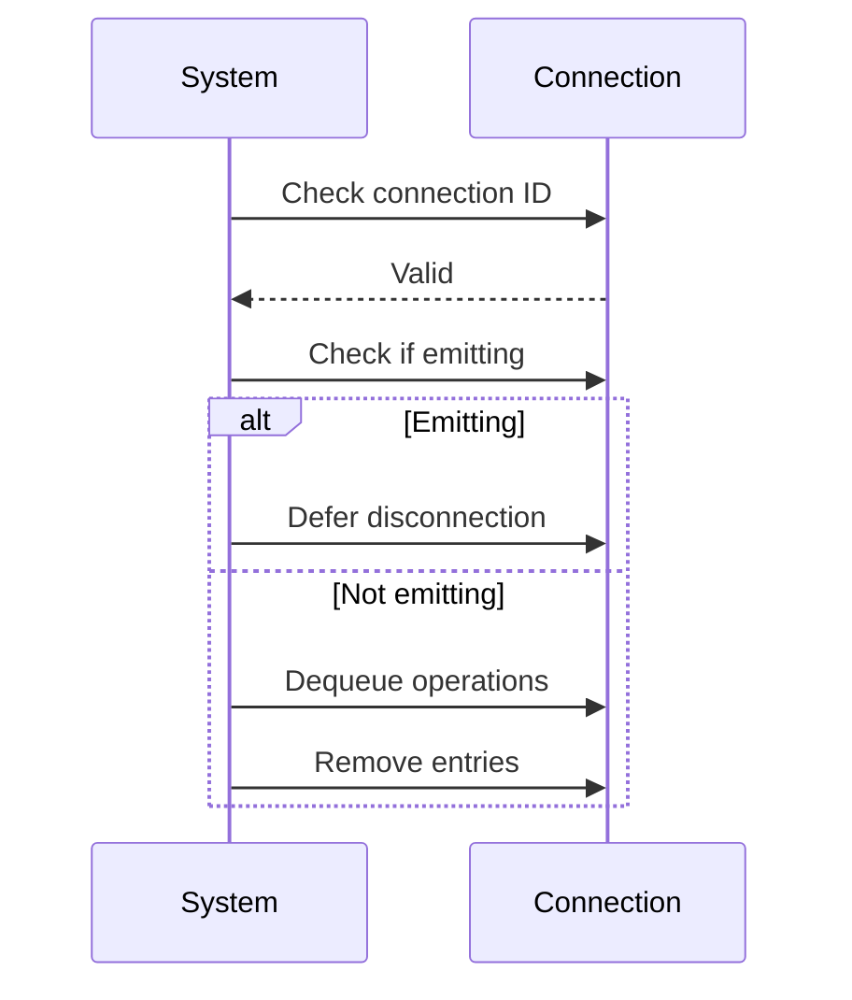
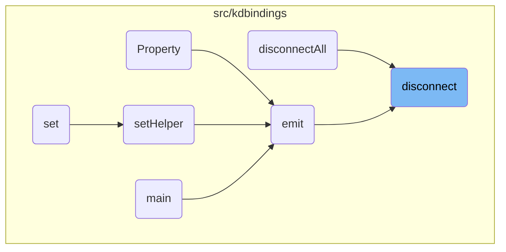
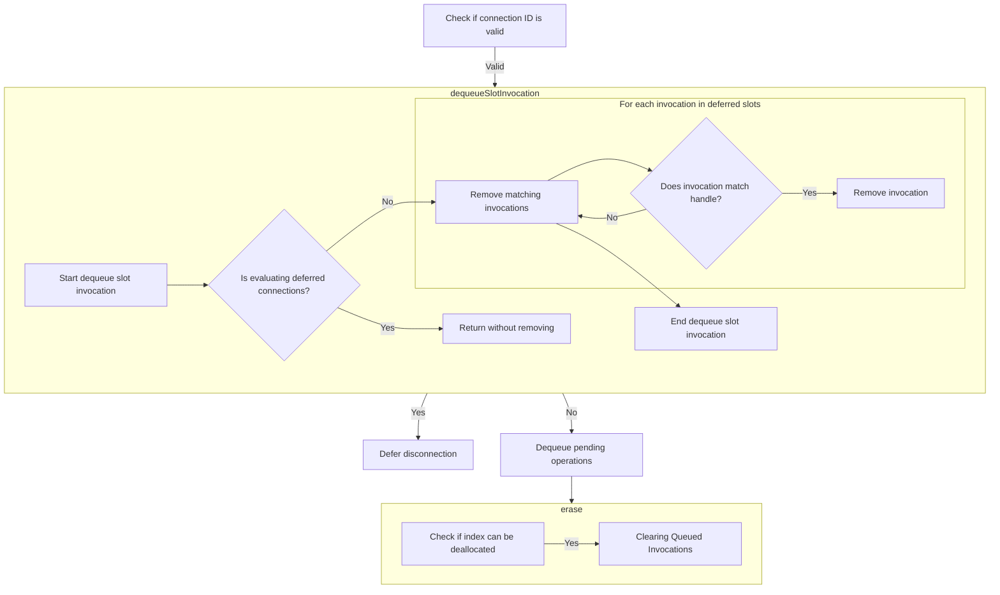
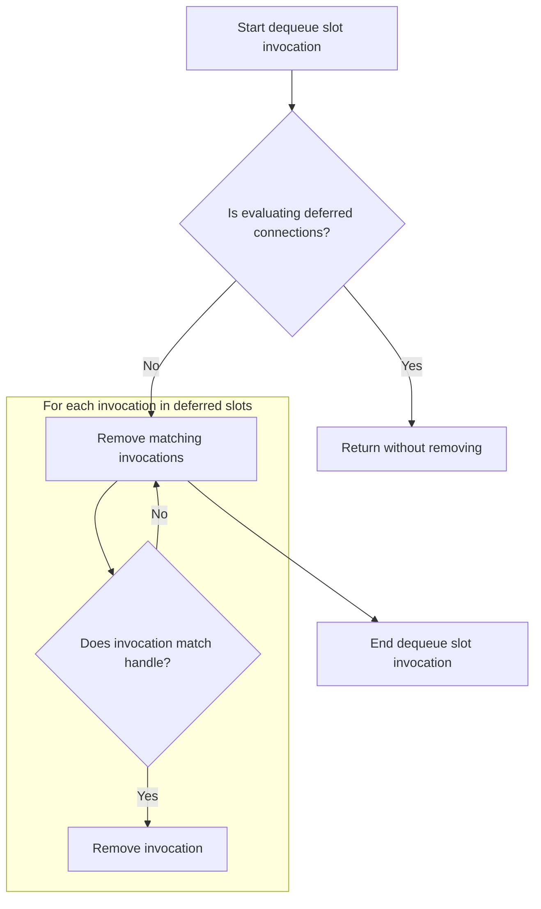

This document describes the process of managing connection termination within the system. The flow ensures that connections are safely disconnected and resources are freed, maintaining system integrity. For example, if a connection is active and emitting, the disconnection is deferred until emission completes. Once the emission is done, the connection is removed, and resources are freed.

The main steps are:

- Check if the connection ID is valid.
- Determine if the signal is currently emitting.
- If emitting, defer disconnection.
- If not emitting, dequeue pending operations.
- Remove connection entries.



# Where is this flow used?

This flow is used multiple times in the codebase as represented in the following diagram:

(Note - these are only some of the entry points of this flow)



# Managing Connection Termination



<SwmSnippet path="/src/kdbindings/signal.h" line="137" repo-id="Z2l0aHViJTNBJTNBS0RCaW5kaW5ncyUzQSUzQUxvaXBmaW5nZXJN">

---

Here, we handle the disconnection of a function by first checking if the connection is valid and currently emitting. If so, we defer disconnection until emission completes. Locking is necessary to prevent race conditions and ensure thread safety during this process.

```c
        // Disconnects a previously connected function
        //
        // WARNING: While this function is marked with noexcept, it *may* terminate the program
        // if it is not possible to allocate memory or if mutex locking isn't possible.
        void disconnect(const ConnectionHandle &handle) noexcept override
        {
            // If the connection evaluator is still valid, remove any queued up slot invocations
            // associated with the given handle to prevent them from being evaluated in the future.
            auto idOpt = handle.m_id; // Retrieve the connection associated with this id

            // Proceed only if the id is valid
            if (idOpt.has_value()) {
                auto id = idOpt.value();

                // Retrieve the connection associated with this id
                auto connection = m_connections.get(id);
                if (connection && m_isEmitting) {
                    // We are currently still emitting the signal, so we need to defer the actual
                    // disconnect until the emit is done.
                    connection->toBeDisconnected = true;
                    m_disconnectedDuringEmit = true;
                    return;
                }

                if (connection && connection->m_connectionEvaluator.lock()) {
```

---

</SwmSnippet>

<SwmSnippet path="/src/kdbindings/signal.h" line="163" repo-id="Z2l0aHViJTNBJTNBS0RCaW5kaW5ncyUzQSUzQUxvaXBmaW5nZXJN">

---

Back in disconnect, after locking, we call dequeueSlotInvocation to remove any queued invocations for the connection handle, ensuring no further invocations occur for this connection, which is necessary to avoid unintended behavior.

```c
                        evaluatorPtr->dequeueSlotInvocation(handle);
                    }
                }

```

---

</SwmSnippet>

## Clearing Queued Invocations



<SwmSnippet path="/src/kdbindings/connection_evaluator.h" line="123" repo-id="Z2l0aHViJTNBJTNBS0RCaW5kaW5ncyUzQSUzQUxvaXBmaW5nZXJN">

---

Finally, we call erase to completely remove the connection from the system, freeing up resources and ensuring no dangling references remain, which is essential for maintaining system integrity.

```c
    // Note: This function is marked with noexcept but may theoretically encounter an exception and terminate the program if locking the mutex fails.
    // If this does happen though, there's likely something very wrong, so std::terminate is actually a reasonable way to handle this.
    //
    // In addition, we do need to use a recursive_mutex, as otherwise a slot from `enqueueSlotInvocation` may theoretically call this function and cause undefined behavior.
    void dequeueSlotInvocation(const ConnectionHandle &handle) noexcept
    {
        std::lock_guard<std::recursive_mutex> lock(m_slotInvocationMutex);

        if (m_isEvaluating) {
            // It's too late, we're already evaluating the deferred connections.
            // We can't remove the invocation now, as it might be currently evaluated.
            // And removing any invocations would be undefined behavior as we would invalidate
            // the loop indices in `evaluateDeferredConnections`.
            return;
        }

        auto handleMatches = [&handle](const auto &invocationPair) {
            return invocationPair.first == handle;
        };

        // Remove all invocations that match the handle
        m_deferredSlotInvocations.erase(
                std::remove_if(m_deferredSlotInvocations.begin(), m_deferredSlotInvocations.end(), handleMatches),
                m_deferredSlotInvocations.end());
    }
```

---

</SwmSnippet>

## Removing Connection Entries

<SwmSnippet path="/src/kdbindings/genindex_array.h" line="144" repo-id="Z2l0aHViJTNBJTNBS0RCaW5kaW5ncyUzQSUzQUxvaXBmaW5nZXJN">

---

Next, we call deallocate to free up the index used by the connection, ensuring efficient resource management and preventing memory leaks by releasing all resources tied to the connection.

```c
    // Erase the value at the specified index and free up the index again
    void erase(GenerationalIndex index)
    {
        if (m_allocator.deallocate(index))
            m_entries[index.index] = std::nullopt;
    }
```

---

</SwmSnippet>

## Releasing Connection Resources

<SwmSnippet path="/src/kdbindings/genindex_array.h" line="79" repo-id="Z2l0aHViJTNBJTNBS0RCaW5kaW5ncyUzQSUzQUxvaXBmaW5nZXJN">

---

Here, we check if the index is live to determine if it needs to be deactivated, ensuring only active resources are deallocated, which is crucial to prevent errors.

```c
    bool deallocate(GenerationalIndex index)
    {
        if (isLive(index)) {
            m_entries[index.index].isLive = false;
            m_freeIndices.emplace_back(index.index);
            return true;
        }

        return false;
    }
```

---

</SwmSnippet>

<SwmSnippet path="/src/kdbindings/genindex_array.h" line="90" repo-id="Z2l0aHViJTNBJTNBS0RCaW5kaW5ncyUzQSUzQUxvaXBmaW5nZXJN">

---

Here, we verify if the index is active by checking bounds, generation match, and the isLive flag.

```c
    bool isLive(GenerationalIndex index) const noexcept
    {
        return index.index < m_entries.size() &&
                m_entries[index.index].generation == index.generation &&
                m_entries[index.index].isLive;
    }
```

---

</SwmSnippet>

## Finalizing Disconnection

<SwmSnippet path="/src/kdbindings/signal.h" line="167" repo-id="Z2l0aHViJTNBJTNBS0RCaW5kaW5ncyUzQSUzQUxvaXBmaW5nZXJN">

---

Finally, after returning from dequeueSlotInvocation, we call erase to remove the connection from the connections map, preventing future access and freeing up resources, which is crucial for maintaining system integrity.

```c
                // Note: This function may throw if we're out of memory.
                // As `disconnect` is marked as `noexcept`, this will terminate the program.
                m_connections.erase(id);
            }
        }
```

---

</SwmSnippet>

&nbsp;

*This is an auto-generated document by Swimm 🌊 and has not yet been verified by a human*

<SwmMeta version="3.0.0"><sup>Powered by [Swimm](https://app.swimm.io/)</sup></SwmMeta>
