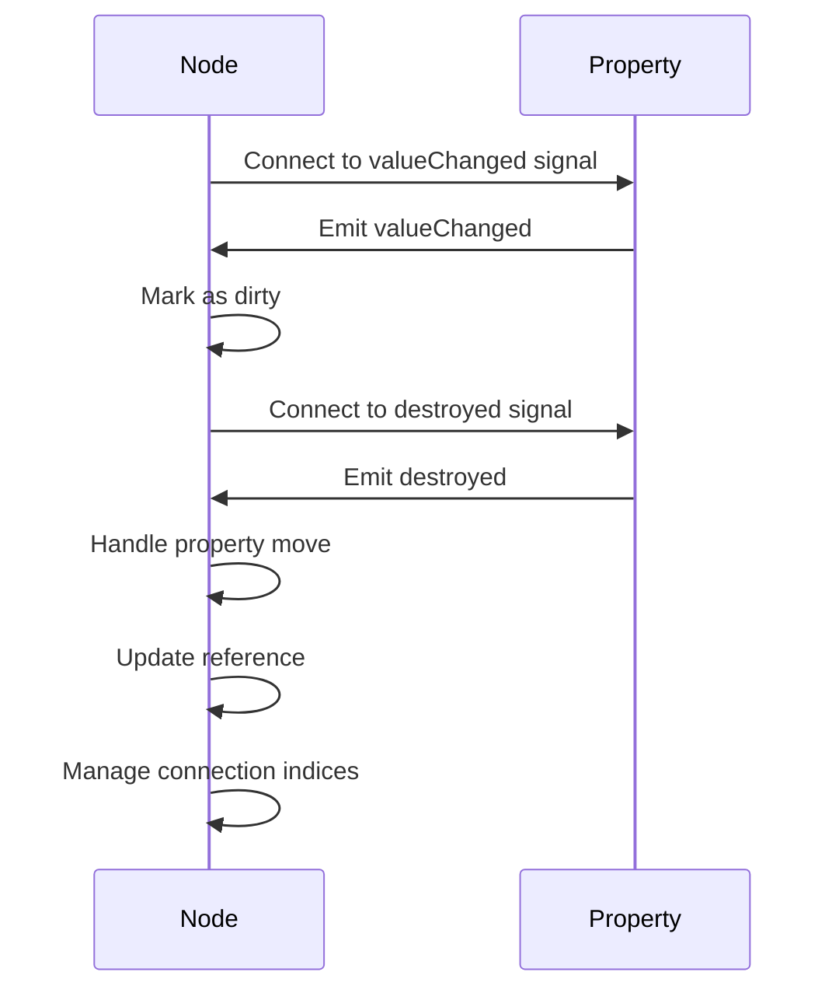
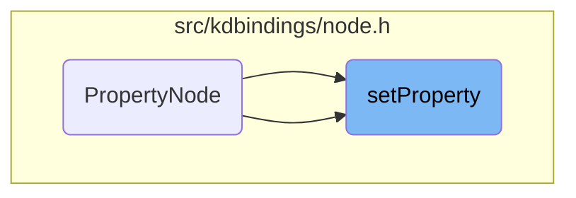
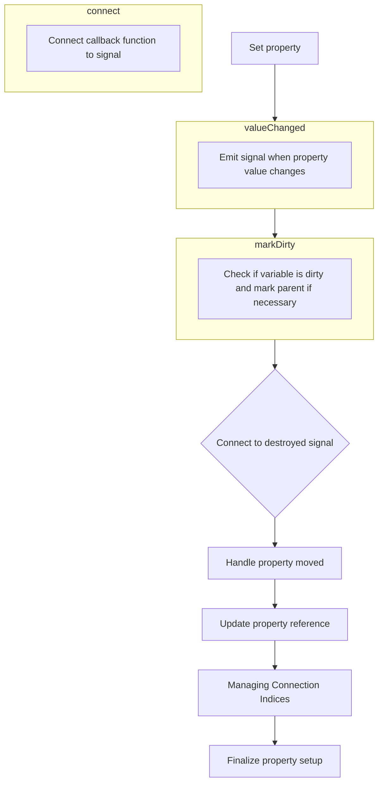

The setProperty flow manages the connection and updates of a property within a node. It tracks changes to the property, marks the node as dirty when necessary, and updates references if the property is moved. For example, when a property is set, the node connects to its signals, marks itself as dirty upon changes, and updates references if the property is moved.

The main steps are:

- Connect to the property's valueChanged signal.
- Mark the node as dirty when the property changes.
- Connect to the property's destroyed signal.
- Handle property move and update reference.
- Manage connection indices for efficient storage.



# Where is this flow used?

This flow is used multiple times in the codebase as represented in the following diagram:



# Initializing Property Connection



<SwmSnippet path="/src/kdbindings/node.h" line="208" repo-id="Z2l0aHViJTNBJTNBS0RCaW5kaW5ncyUzQSUzQUxvaXBmaW5nZXJN">

---

We start the flow by connecting to the property's valueChanged signal to track changes, allowing the system to mark the node as dirty when the property changes, ensuring updates to dependent computations.

```c
    void setProperty(const Property<PropertyType> &property)
    {
        m_property = &property;

        // Connect to all signals, even for const properties
        m_valueChangedHandle = m_property->valueChanged().connect([this]() { this->markDirty(); });
```

---

</SwmSnippet>

## Emitting Property Change Signal

<SwmSnippet path="/src/kdbindings/property.h" line="292" repo-id="Z2l0aHViJTNBJTNBS0RCaW5kaW5ncyUzQSUzQUxvaXBmaW5nZXJN">

---

Returns a signal emitted on property value change, carrying the new value, allowing observers to update their state based on the property's new value.

```c
     * Returns a Signal that will be emitted after the value of the property changed.
     *
     * The emitted value is the current (new) value of the Property.
     */
    Signal<const T &> &valueChanged() const { return m_valueChanged; }
```

---

</SwmSnippet>

## Handling Property Change

## Marking Node as Dirty

<SwmSnippet path="/src/kdbindings/node.h" line="54" repo-id="Z2l0aHViJTNBJTNBS0RCaW5kaW5ncyUzQSUzQUxvaXBmaW5nZXJN">

---

First, retrieve the dirty variable to check and update the node's dirty status, ensuring the node is only marked as dirty if it hasn't been already, preventing unnecessary re-evaluations.

```c
    // overridden by Binding
    virtual void markDirty()
    {
        auto *dirtyVar = dirtyVariable();
```

---

</SwmSnippet>

<SwmSnippet path="/src/kdbindings/node.h" line="58" repo-id="Z2l0aHViJTNBJTNBS0RCaW5kaW5ncyUzQSUzQUxvaXBmaW5nZXJN">

---

Back in markDirty, check if the node is already dirty, mark it if not, and retrieve the parent variable to propagate changes, ensuring changes propagate up the hierarchy, allowing dependent nodes to be updated accordingly.

```c
        if (dirtyVar) {
            if (*dirtyVar) {
                return;
                // We are already dirty, don't bother marking the whole tree again.
            }

            // we only want to have one override for dirtyVariable,
            // which is const, so we have to const cast here.
            *const_cast<bool *>(dirtyVar) = true;
        }

        auto **parentVar = parentVariable();
```

---

</SwmSnippet>

<SwmSnippet path="/src/kdbindings/node.h" line="142" repo-id="Z2l0aHViJTNBJTNBS0RCaW5kaW5ncyUzQSUzQUxvaXBmaW5nZXJN">

---

Determine parent variable; constant node returns nullptr as it cannot be dirty, simplifying the flow by eliminating unnecessary notifications for constant nodes, which do not change.

```c
    // A constant can never be dirty, so it doesn't need to
    // know its parent, as it doesn't have to notify it.
    Dirtyable **parentVariable() override { return nullptr; }
```

---

</SwmSnippet>

<SwmSnippet path="/src/kdbindings/node.h" line="70" repo-id="Z2l0aHViJTNBJTNBS0RCaW5kaW5ncyUzQSUzQUxvaXBmaW5nZXJN">

---

Back in markDirty, check if the parent variable exists and is live, then mark the parent node as dirty to propagate changes, ensuring changes propagate up the hierarchy, maintaining the integrity of the dependency graph.

```c
        if (parentVar && *parentVar) {
            (*parentVar)->markDirty();
        }
    }
```

---

</SwmSnippet>

## Finalizing Property Setup

## Establishing Signal Connection

<SwmSnippet path="/src/kdbindings/signal.h" line="95" repo-id="Z2l0aHViJTNBJTNBS0RCaW5kaW5ncyUzQSUzQUxvaXBmaW5nZXJN">

---

Finally, establish the connection and add it to active connections for efficient management, enabling efficient management, including disconnecting when needed.

```c
        // Connects a std::function to the signal. The returned
        // value can be used to disconnect the function again.
        Private::GenerationalIndex connect(std::function<void(Args...)> const &slot)
        {
            Connection newConnection;
            newConnection.slot = slot;
            return m_connections.insert(std::move(newConnection));
        }
```

---

</SwmSnippet>

## Managing Connection Indices

<SwmSnippet path="/src/kdbindings/genindex_array.h" line="136" repo-id="Z2l0aHViJTNBJTNBS0RCaW5kaW5ncyUzQSUzQUxvaXBmaW5nZXJN">

---

Next, add a new connection by finding a free index for efficient storage, ensuring connections are stored efficiently, using available space without exceeding limits.

```c
    // Insert a value at the first free index and get the index back
    GenerationalIndex insert(T &&value)
    {
        const auto index = m_allocator.allocate();
```

---

</SwmSnippet>

<SwmSnippet path="/src/kdbindings/genindex_array.h" line="57" repo-id="Z2l0aHViJTNBJTNBS0RCaW5kaW5ncyUzQSUzQUxvaXBmaW5nZXJN">

---

Find a free index for storing a new connection, using available space or expanding if needed, ensuring new connections can be accommodated even when no free indices are available.

```c
    GenerationalIndex allocate()
    {
        if (m_freeIndices.size() > 0) {
            uint32_t index = m_freeIndices.back();
            m_freeIndices.pop_back();

            m_entries[index].generation += 1;
            m_entries[index].isLive = true;

            return { index, m_entries[index].generation };
        } else {
            // check that we are still within the bounds of uint32_t
            // (parentheses added to avoid Windows min/max macros)
            if (m_entries.size() + 1 >= (std::numeric_limits<uint32_t>::max)()) {
                throw std::length_error(std::string("Maximum number of values inside GenerationalIndexArray reached: ") + std::to_string(m_entries.size()));
            }

            m_entries.push_back({ true, 0 });
            return { static_cast<uint32_t>(m_entries.size()) - 1, 0 };
        }
    }
```

---

</SwmSnippet>

<SwmSnippet path="/src/kdbindings/genindex_array.h" line="140" repo-id="Z2l0aHViJTNBJTNBS0RCaW5kaW5ncyUzQSUzQUxvaXBmaW5nZXJN">

---

Back in insert, store the new connection at the allocated index and assign it to finalize insertion, ensuring the connection is properly stored and can be accessed or managed later.

```c
        set(index, std::move(value));
        return index;
    }
```

---

</SwmSnippet>

<SwmSnippet path="/src/kdbindings/genindex_array.h" line="117" repo-id="Z2l0aHViJTNBJTNBS0RCaW5kaW5ncyUzQSUzQUxvaXBmaW5nZXJN">

---

Assign a value to a specific index, ensuring the collection is large enough and storing the value correctly, maintaining the integrity of the collection, allowing values to be stored correctly and retrieved or modified as needed.

```c
    // Sets the value at a specific index inside the array
    void set(const GenerationalIndex index, T &&value)
    {
        while (m_entries.size() <= index.index)
            m_entries.emplace_back(std::nullopt);
```

---

</SwmSnippet>

<SwmSnippet path="/src/kdbindings/genindex_array.h" line="121" repo-id="Z2l0aHViJTNBJTNBS0RCaW5kaW5ncyUzQSUzQUxvaXBmaW5nZXJN">

---

Modifies the collection by storing the value at the specified index, updating the collection's state, ensuring that the correct value is stored and can be accessed later.

```c
            m_entries.emplace_back(std::nullopt);

#ifndef NDEBUG
        uint32_t previousGeneration = 0;

        const auto &previousEntry = m_entries[index.index];
        if (previousEntry)
            previousGeneration = previousEntry->generation;

        assert(index.generation >= previousGeneration);
#endif

        m_entries[index.index] = std::optional<Entry>{ { index.generation, std::move(value) } };
    }
```

---

</SwmSnippet>

## Completing Property Connection

<SwmSnippet path="/src/kdbindings/node.h" line="187" repo-id="Z2l0aHViJTNBJTNBS0RCaW5kaW5ncyUzQSUzQUxvaXBmaW5nZXJN">

---

Handle property move by updating the reference or setting it to nullptr if unchanged, ensuring the node no longer updates based on the moved property, maintaining connection integrity.

```c
    void propertyMoved(const Property<PropertyType> &property)
    {
        if (&property != m_property) {
            m_property = &property;
        } else {
            // Another property was moved into the property this node refers to.
            // Therefore it will no longer update this Node.
            m_property = nullptr;
        }
    }
```

---

</SwmSnippet>

## Adjusting Property Reference

## Finalizing Node Setup

<SwmSnippet path="/src/kdbindings/node.h" line="215" repo-id="Z2l0aHViJTNBJTNBS0RCaW5kaW5ncyUzQSUzQUxvaXBmaW5nZXJN">

---

Finally, set up a connection to the property's destroyed signal to respond to property destruction, ensuring the node can clean up or adjust its state when the property it depends on is no longer available.

```c
        m_destroyedHandle = m_property->destroyed().connect([this]() { this->propertyDestroyed(); });
    }
```

---

</SwmSnippet>

&nbsp;

*This is an auto-generated document by Swimm 🌊 and has not yet been verified by a human*

<SwmMeta version="3.0.0"><sup>Powered by [Swimm](https://staging.swimm.cloud/)</sup></SwmMeta>
