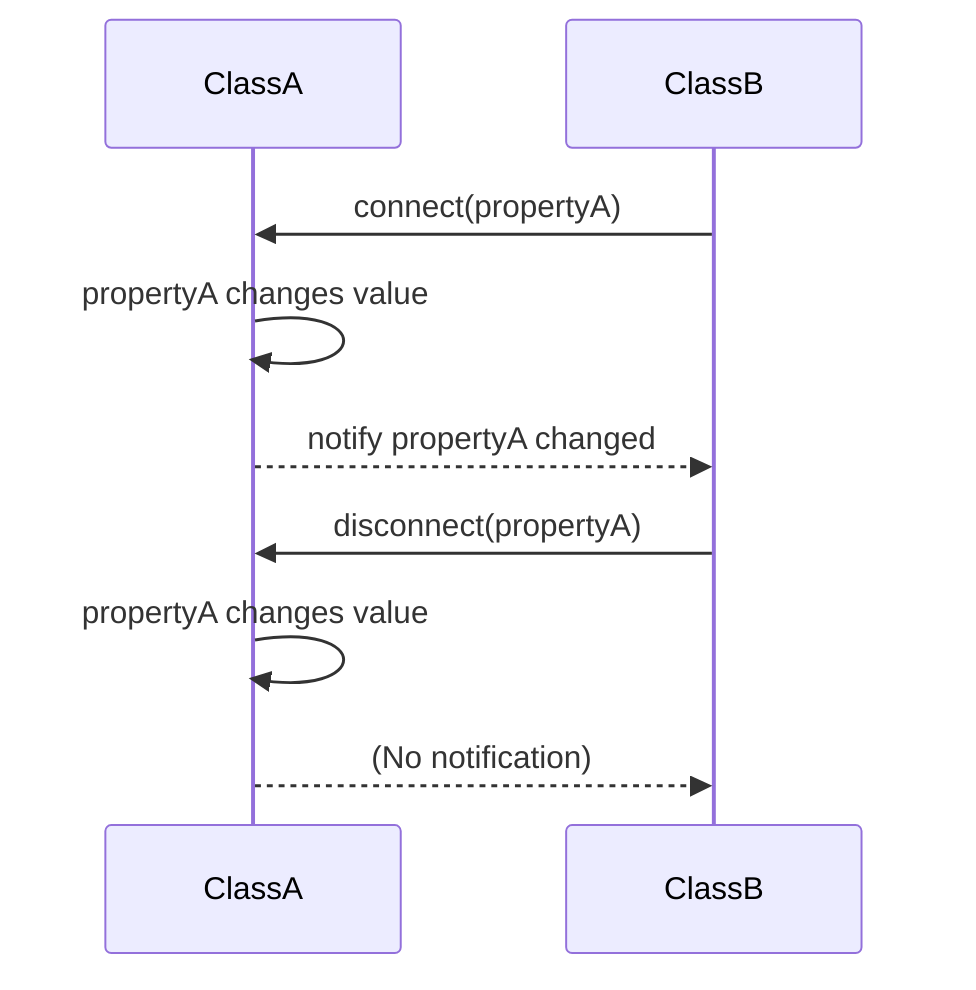

# Introduction

This document will walk you through the implementation of the <SwmToken path="/src/kdbindings/property.h" pos="51:27:27" line-data=" * A ReadOnlyProperty is thrown when trying to set the value of a Property">`Property`</SwmToken> class in the <SwmToken path="/src/kdbindings/property.h" pos="2:11:11" line-data="  This file is part of KDBindings.">`KDBindings`</SwmToken> library. The <SwmToken path="/src/kdbindings/property.h" pos="51:27:27" line-data=" * A ReadOnlyProperty is thrown when trying to set the value of a Property">`Property`</SwmToken> class is a core component for managing values that can be part of or result from data binding operations.

We will cover:

1. How equality comparison is handled for properties.
2. The design of the <SwmToken path="/src/kdbindings/property.h" pos="51:27:27" line-data=" * A ReadOnlyProperty is thrown when trying to set the value of a Property">`Property`</SwmToken> class, including its lifecycle and operations.
3. The role of signals in property change notifications.
4. The handling of property bindings and updates.

# Equality comparison in properties

<SwmSnippet path="/src/kdbindings/property.h" line="62">

---

The <SwmToken path="/src/kdbindings/property.h" pos="41:5:5" line-data="                                                       decltype(std::equal_to&lt;&gt;{}(std::declval&lt;X&gt;(), std::declval&lt;Y&gt;()))&gt;,">`equal_to`</SwmToken> struct is crucial for determining if two values of type <SwmToken path="/src/kdbindings/property.h" pos="64:11:11" line-data=" * two values of type T are equal in the context of data binding.">`T`</SwmToken> are equal within the context of data binding. This is important because it prevents unnecessary updates and signal emissions when the value hasn't actually changed.

```
/**
 * @brief An instance of the KDBindings::equal_to struct is used to decide whether
 * two values of type T are equal in the context of data binding.
 *
 * If a new value is assigned to a Property and the existing value is equal_to
 * the existing value, the Property will not emit the Property::valueChanged or
 * Property::valueAboutToChange signals and not change the stored value.
 *
 * By default, all classes T that are equality comparable using std::equal_to
 * delegate to std::equal_to for equality comparison. All other instances are
 * assumed to never be equal.
 * Therefore, to change the equality behavior of a Property<T>, either:
 * - Implement operator== for T (std::equal_to uses operator== for equality comparison)
 * - Provide a template spezialization of KDBindings::equal_to and implement operator()()
 */
template<typename T>
struct equal_to {
    /**
     * This implementation of operator()() is only enabled if std::equal_to can be
     * used to compare values of type T.
     * In this case, std::equal_to is used to decide whether values of type T are equal.
     *
     * @return bool - Whether the values are equal.
     */
    auto operator()(const T &x, const T &y) const noexcept
            -> std::enable_if_t<Private::are_equality_comparable_v<T, T>, bool>
    {
        return std::equal_to<>{}(x, y);
    }
```

---

</SwmSnippet>

# Property class design

<SwmSnippet path="/src/kdbindings/property.h" line="115">

---

The <SwmToken path="/src/kdbindings/property.h" pos="51:27:27" line-data=" * A ReadOnlyProperty is thrown when trying to set the value of a Property">`Property`</SwmToken> class is designed to manage a value that can be part of a data binding. It supports default construction, destruction, and move semantics, but it is not copyable. This ensures that properties are unique and maintain their connections and bindings correctly.

```
/**
 * @brief A property represents a value that can be part of or the result of data binding.
 *
 * Properties are at the basis of data binding.
 * They can contain a value of any type T.
 * The value can either represent the result of a data binding or a value that is used
 * in the calculation of a binding expression.
 *
 * If the value of a property is changed, either manually or because it is the result of a
 * binding expression, the Property will emit the valueAboutToChange(), and valueChanged() Signal.
 * If it is used as part of a binding expression, the expression will be marked
 * as dirty and (unless a custom BindingEvaluator is used) updated immediately.
 *
 * To create a property from a data binding expression, use the @ref makeBoundProperty or @ref makeBinding
 * functions in the @ref KDBindings namespace.
 *
 * Examples:
 * - @ref 04-simple-property/main.cpp
 * - @ref 05-property-bindings/main.cpp
 * - @ref 06-lazy-property-bindings/main.cpp
 */
template<typename T>
class Property
{
public:
    typedef T valuetype;
```

---

</SwmSnippet>

# Property lifecycle and operations

<SwmSnippet path="/src/kdbindings/property.h" line="157">

---

Properties can be constructed with a value or a <SwmToken path="/src/kdbindings/property.h" pos="52:9:9" line-data=" * that has a PropertyUpdater associated with it.">`PropertyUpdater`</SwmToken>. They emit signals when their value changes or when they are destroyed. The <SwmToken path="/src/kdbindings/property.h" pos="51:17:17" line-data=" * A ReadOnlyProperty is thrown when trying to set the value of a Property">`set`</SwmToken> method assigns a new value, but throws an exception if the property is <SwmToken path="/src/kdbindings/property.h" pos="326:12:14" line-data="                &quot;Cannot set value on a read-only property. This property likely holds the result of a binding expression.&quot;">`read-only`</SwmToken> due to a binding.

```
    /**
     * Constructs a Property from the provided value.
     */
    explicit Property(T value) noexcept(std::is_nothrow_move_constructible<T>::value)
        : m_value{ std::move(value) }
    {
    }
```

---

</SwmSnippet>

# Signals for property change notifications

<SwmSnippet path="/src/kdbindings/property.h" line="283">

---

Signals are emitted before and after a property's value changes, allowing observers to react to these changes. This is a key feature for integrating properties into data binding expressions.

```
    /**
     * Returns a Signal that will be emitted before the value is changed.
     *
     * The first emitted value is the current value of the Property.<br>
     * The second emitted value is the new value of the Property.
     */
    Signal<const T &, const T &> &valueAboutToChange() const { return m_valueAboutToChange; }
```

---

</SwmSnippet>

# Handling property bindings and updates

<SwmSnippet path="/src/kdbindings/property.h" line="303">

---

Properties can be associated with a <SwmToken path="/src/kdbindings/property.h" pos="52:9:9" line-data=" * that has a PropertyUpdater associated with it.">`PropertyUpdater`</SwmToken>, which automatically updates the property's value. The <SwmToken path="/src/kdbindings/property.h" pos="276:25:25" line-data="     * The value of the property does not change when it is reset.">`reset`</SwmToken> method disconnects the binding, while the <SwmToken path="/src/kdbindings/property.h" pos="306:3:3" line-data="    bool hasBinding() const noexcept { return m_updater.get() != nullptr; }">`hasBinding`</SwmToken> method checks if a binding exists.

```
    /**
     * Returns true if this Property has a binding associated with it.
     */
    bool hasBinding() const noexcept { return m_updater.get() != nullptr; }
```

---

</SwmSnippet>

## Example: Property Connection Lifetime



# Conclusion

The <SwmToken path="/src/kdbindings/property.h" pos="51:27:27" line-data=" * A ReadOnlyProperty is thrown when trying to set the value of a Property">`Property`</SwmToken> class in <SwmToken path="/src/kdbindings/property.h" pos="2:11:11" line-data="  This file is part of KDBindings.">`KDBindings`</SwmToken> is a versatile tool for managing values in data binding contexts. Its design ensures efficient value management and change notifications, making it a fundamental part of the <SwmToken path="/src/kdbindings/property.h" pos="2:11:11" line-data="  This file is part of KDBindings.">`KDBindings`</SwmToken> library.

<SwmMeta version="3.0.0" repo-id="Z2l0aHViJTNBJTNBS0RCaW5kaW5ncyUzQSUzQUxvaXBmaW5nZXJN" repo-name="KDBindings"><sup>Powered by [Swimm](https://app.swimm.io/)</sup></SwmMeta>
