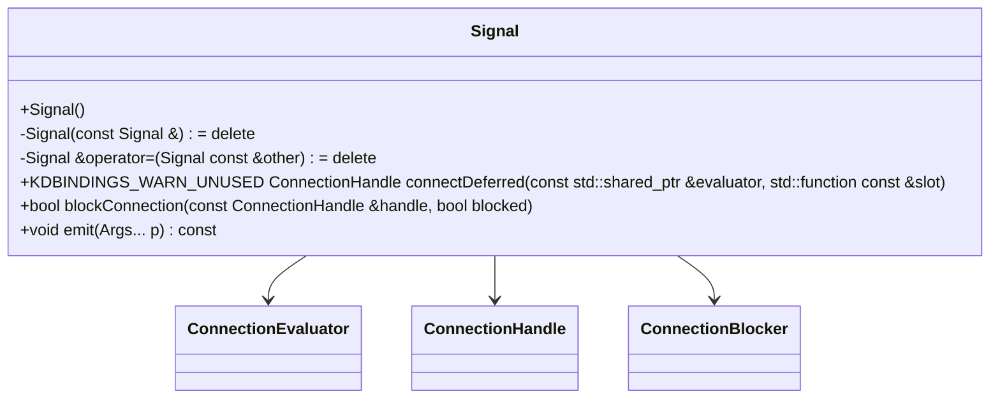

# Introduction



This document will walk you through the design and implementation of the <SwmToken path="/src/kdbindings/signal.h" pos="298:1:1" line-data="    Signal() = default;">`Signal`</SwmToken> class within the <SwmToken path="/src/kdbindings/signal.h" pos="2:11:11" line-data="  This file is part of KDBindings.">`KDBindings`</SwmToken> library. The <SwmToken path="/src/kdbindings/signal.h" pos="298:1:1" line-data="    Signal() = default;">`Signal`</SwmToken> class is a crucial component for enabling communication between objects in a <SwmToken path="/src/kdbindings/signal.h" pos="51:13:15" line-data=" * This connection happens in a type-safe manner, as a slot can only be connected to">`type-safe`</SwmToken> manner, similar to Qt's Signals & Slots mechanism but implemented in pure C++17.

We will cover:

1. Why the <SwmToken path="/src/kdbindings/signal.h" pos="298:1:1" line-data="    Signal() = default;">`Signal`</SwmToken> class is designed to be non-copyable and non-movable.
2. How deferred connections are implemented and their purpose.
3. The mechanism for blocking and unblocking connections.
4. The process of emitting signals and handling connections during emission.

# Non-copyable and non-movable design

<SwmSnippet path="/src/kdbindings/signal.h" line="296">

---

The <SwmToken path="/src/kdbindings/signal.h" pos="298:1:1" line-data="    Signal() = default;">`Signal`</SwmToken> class is designed to be non-copyable and non-movable to ensure the integrity of connection handles. This prevents unintended sharing or loss of connections when a <SwmToken path="/src/kdbindings/signal.h" pos="298:1:1" line-data="    Signal() = default;">`Signal`</SwmToken> object is copied or moved. The implementation uses a shared pointer to manage the internal state, allowing for safe reference checks without enabling copy semantics.

```
public:
    /** Signals are default constructible */
    Signal() = default;

    /**
     * Signals cannot be copied.
     **/
    Signal(const Signal &) = delete;
    Signal &operator=(Signal const &other) = delete;
```

---

</SwmSnippet>

/

&nbsp;

# Deferred connections

<SwmSnippet path="/src/kdbindings/signal.h" line="385">

---

Deferred connections allow slots to be executed at a later time, decoupling signal emission from slot execution. This is useful for asynchronous or delayed operations. The implementation uses a <SwmToken path="/src/kdbindings/signal.h" pos="393:29:29" line-data="     * First argument to the function is reference to a shared pointer to the ConnectionEvaluator responsible for determining">`ConnectionEvaluator`</SwmToken> to manage these deferred connections, ensuring that slots are only executed when specific conditions are met.

```
    /**
     * @brief Establishes a deferred connection between the provided evaluator and slot.
     *
     * @warning Deferred connections are experimental and may be removed or changed in the future.
     *
     * This function allows connecting an evaluator and a slot such that the slot's execution
     * is deferred until the conditions evaluated by the `evaluator` are met.
     *
     * First argument to the function is reference to a shared pointer to the ConnectionEvaluator responsible for determining
     * when the slot should be executed.
     *
     * @return An instance of ConnectionHandle, that can be used to disconnect
     * or temporarily block the connection.
     *
     * @note
     * The Signal class itself is not thread-safe. While the ConnectionEvaluator is inherently
     * thread-safe, ensure that any concurrent access to this Signal is protected externally to maintain thread safety.
     *
     * @warning Connecting functions to a signal that throw an exception when called is currently undefined behavior.
     * All connected functions should handle their own exceptions.
     * For backwards-compatibility, the slot function is not required to be noexcept.
     */
    KDBINDINGS_WARN_UNUSED ConnectionHandle connectDeferred(const std::shared_ptr<ConnectionEvaluator> &evaluator, std::function<void(Args...)> const &slot)
    {
        ensureImpl();
```

---

</SwmSnippet>

# Blocking and unblocking connections

<SwmSnippet path="/src/kdbindings/signal.h" line="501">

---

Connections can be temporarily blocked to prevent slots from being called during signal emission. This is managed through the <SwmToken path="/src/kdbindings/signal.h" pos="518:3:3" line-data="    bool blockConnection(const ConnectionHandle &amp;handle, bool blocked)">`blockConnection`</SwmToken> method, which alters the blocked state of a connection. The <SwmToken path="/src/kdbindings/signal.h" pos="508:24:24" line-data="     * To temporarily block a connection, consider using an instance of ConnectionBlocker,">`ConnectionBlocker`</SwmToken> class provides a <SwmToken path="/src/kdbindings/signal.h" pos="509:9:11" line-data="     * which offers a RAII-style implementation that makes sure the connection is always">`RAII-style`</SwmToken> mechanism for managing the blocked state, ensuring connections return to their original state upon destruction.

```
    /**
     * Sets the block state of the connection.
     * If a connection is blocked, emitting the Signal will no longer call this
     * connections slot, until the connection is unblocked.
     *
     * ConnectionHandle::block can be used as an alternative.
     *
     * To temporarily block a connection, consider using an instance of ConnectionBlocker,
     * which offers a RAII-style implementation that makes sure the connection is always
     * returned to its original state.
     *
     * @param blocked Whether the connection should be blocked from now on.
     * @param handle The ConnectionHandle to block.
     * @return Whether the connection was previously blocked.
     * @throw std::out_of_range - If the ConnectionHandle does not belong to this
     * Signal (i.e. ConnectionHandle::belongsTo returns false).
     */
    bool blockConnection(const ConnectionHandle &handle, bool blocked)
    {
        if (m_impl && handle.belongsTo(*this) && handle.m_id.has_value()) {
            return m_impl->blockConnection(*handle.m_id, blocked);
        } else {
            throw std::out_of_range("Provided ConnectionHandle does not match any connection\nLikely the connection was deleted before!");
        }
    }
```

---

</SwmSnippet>

# Emitting signals

<SwmSnippet path="/src/kdbindings/signal.h" line="550">

---

The <SwmToken path="/src/kdbindings/signal.h" pos="554:11:11" line-data="     * The arguments provided to emit will be passed to each slot by copy,">`emit`</SwmToken> method is responsible for invoking all connected slots with the provided arguments. It ensures that slots are called only if they are not blocked and handles disconnections that occur during emission. The design prevents nested emits and ensures thread safety by requiring external synchronization.

```
    /**
     * Emits the Signal, which causes all connected slots to be called,
     * as long as they are not blocked.
     *
     * The arguments provided to emit will be passed to each slot by copy,
     * therefore consider using (const) references as the Args to the Signal
     * wherever possible.
     *
     * Note: Slots may disconnect themselves during an emit, which will cause the
     * connection to be disconnected after all slots have been called.
     *
     * ⚠️ *Note: Connecting a new slot to a signal while the signal is still
     * in the emit function is undefined behavior.*
     *
     * ⚠️ *Note: This function is **not thread-safe** and **not reentrant**.
     * Specifically, this means it is undefined behavior to emit a signal from
     * a slot of that same signal.*
     */
    void emit(Args... p) const
    {
        if (m_impl)
            m_impl->emit(p...);
```

---

</SwmSnippet>

# Conclusion

The <SwmToken path="/src/kdbindings/signal.h" pos="298:1:1" line-data="    Signal() = default;">`Signal`</SwmToken> class in <SwmToken path="/src/kdbindings/signal.h" pos="2:11:11" line-data="  This file is part of KDBindings.">`KDBindings`</SwmToken> is a robust mechanism for object communication, offering features like deferred connections and connection management. Its design prioritizes type safety and efficient handling of connections, making it a powerful tool for developers needing a C++17-based signaling system.

<SwmMeta version="3.0.0" repo-id="Z2l0aHViJTNBJTNBS0RCaW5kaW5ncyUzQSUzQUxvaXBmaW5nZXJN" repo-name="KDBindings"><sup>Powered by [Swimm](https://app.swimm.io/)</sup></SwmMeta>
