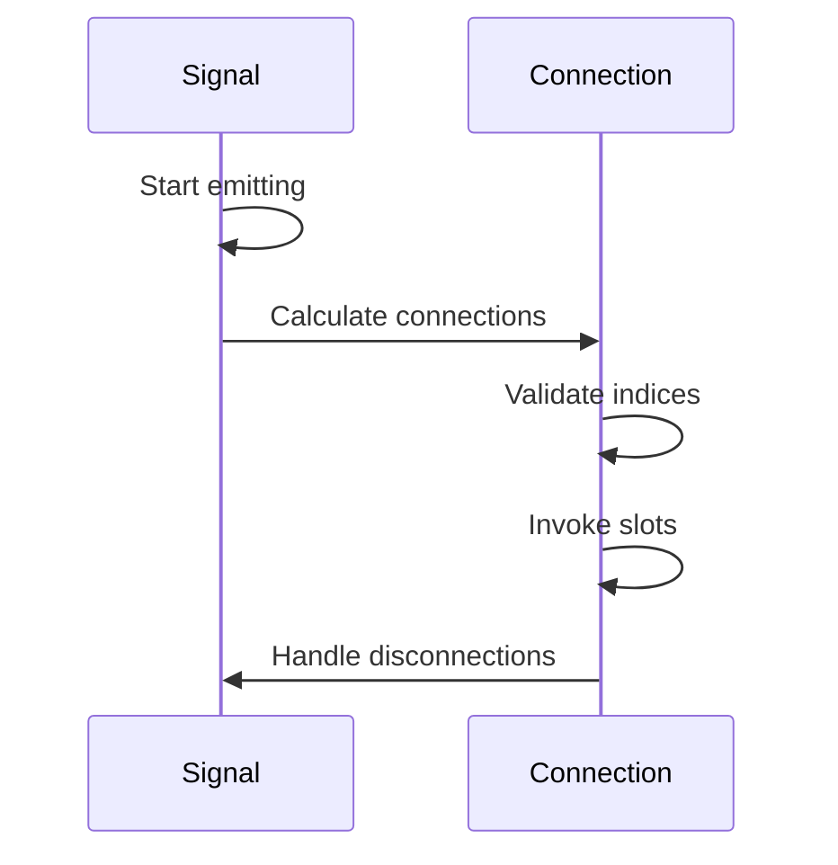
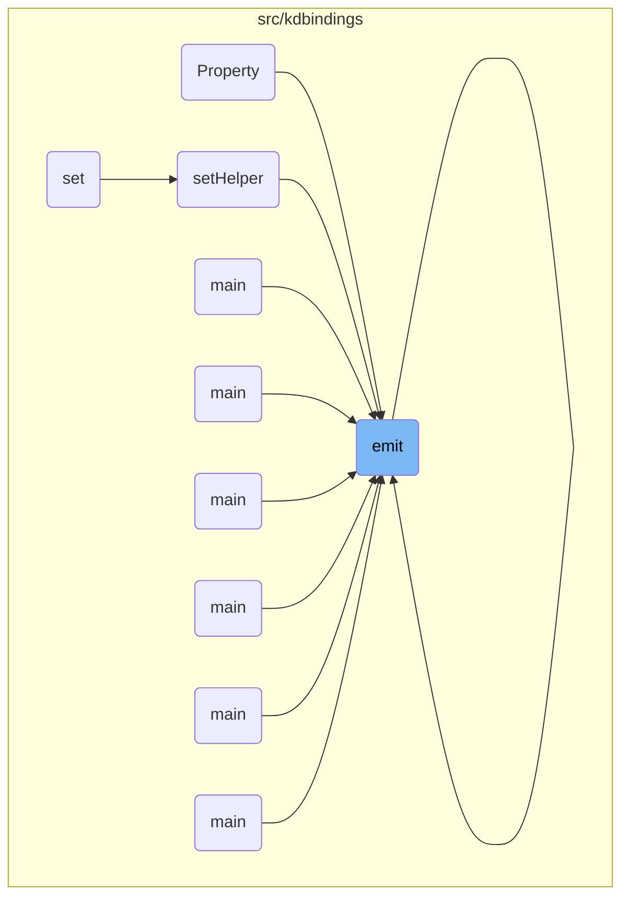
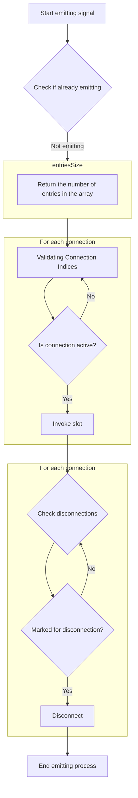
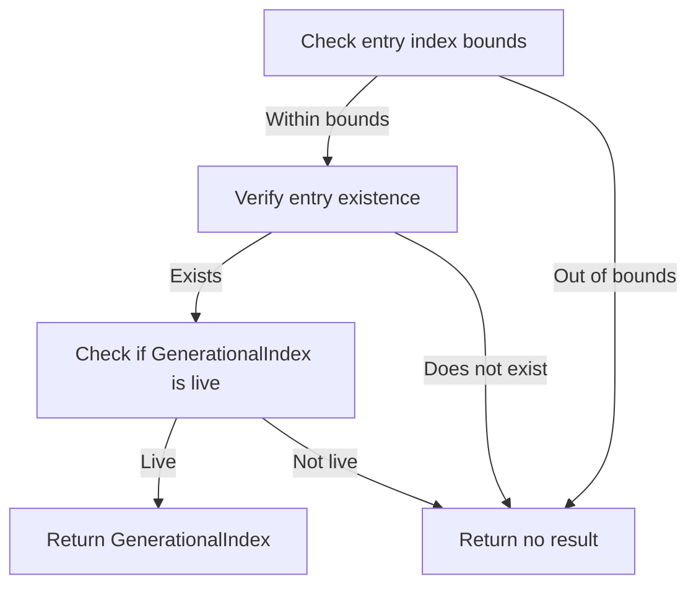
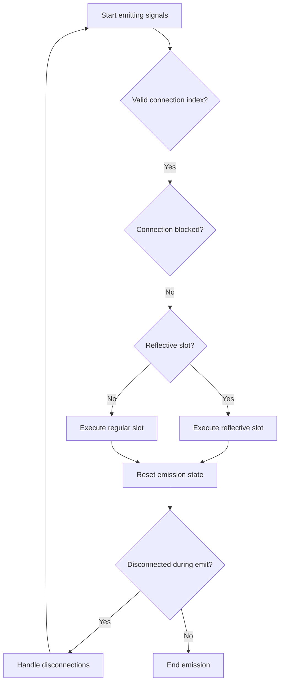
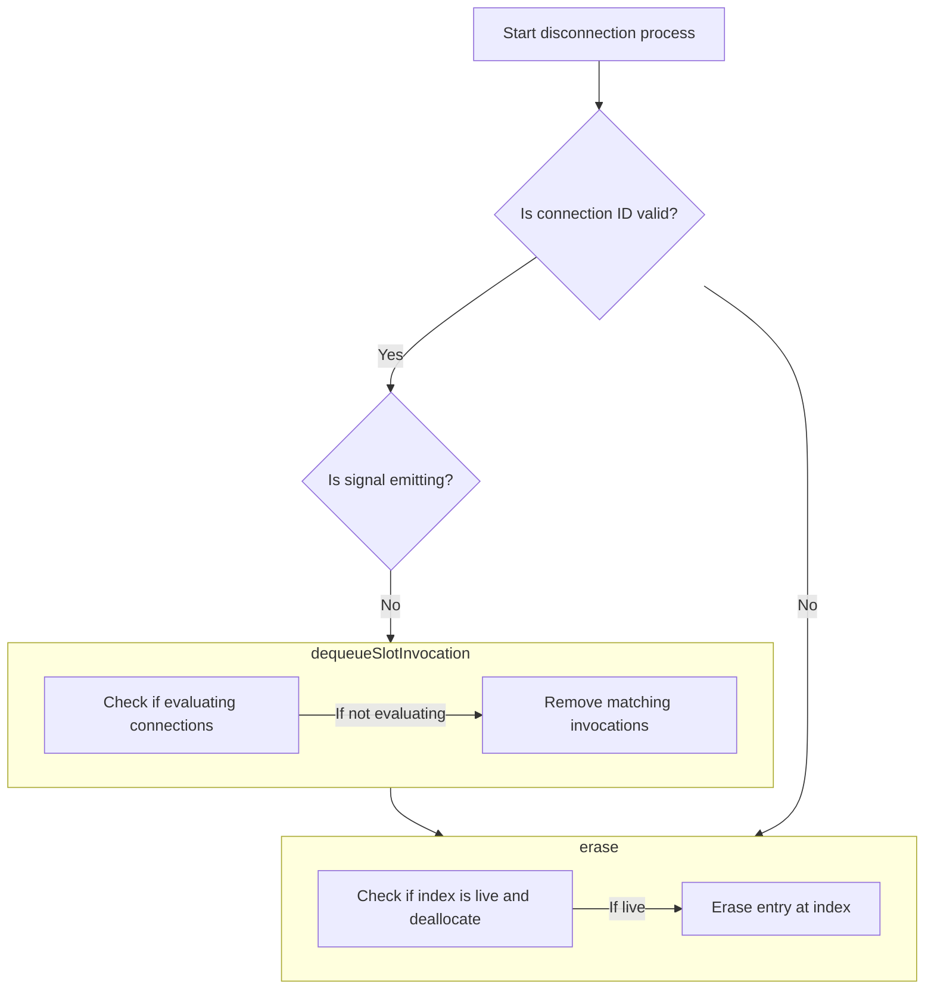

The signal emission flow is a key part of the reactive programming model in KDBindings. It describes how signals are emitted, triggering connected slots to perform actions. This flow ensures that all active connections are notified when a signal is emitted, and handles disconnections safely to maintain system integrity. The main steps are:

- Start emitting signal and check for nested emissions.
- Calculate the number of connections.
- Validate connection indices.
- Process valid connections and invoke slots.
- Handle post-emission disconnections.

For instance, when a property changes, the signal emission flow ensures that all connected slots are notified, allowing them to react accordingly, such as updating a UI component.



# Where is this flow used?

This flow is used multiple times in the codebase as represented in the following diagram:

(Note - these are only some of the entry points of this flow)



# Initiating Signal Emission



<SwmSnippet path="/src/kdbindings/signal.h" line="217" repo-id="Z2l0aHViJTNBJTNBS0RCaW5kaW5ncyUzQSUzQUxvaXBmaW5nZXJN">

---

First, we check for nested emissions and then determine the number of connections using entriesSize to know how many slots are connected and need to be triggered.

```c
        void emit(Args... p)
        {
            if (m_isEmitting) {
                throw std::runtime_error("Signal is already emitting, nested emits are not supported!");
            }
            m_isEmitting = true;

            const auto numEntries = m_connections.entriesSize();

```

---

</SwmSnippet>

## Calculating Connection Count

<SwmSnippet path="/src/kdbindings/genindex_array.h" line="184" repo-id="Z2l0aHViJTNBJTNBS0RCaW5kaW5ncyUzQSUzQUxvaXBmaW5nZXJN">

---

Returns the number of entries in the array, indicating how many potential connections exist that could be notified during a signal emission.

```c
    // The number entries currently in the array, not all necessarily correspond to valid indices,
    // use "indexAtEntry" to translate from an entry index to a optional GenerationalIndex
    uint32_t entriesSize() const noexcept
    {
        // this cast is safe because the allocator checks that we never exceed the capacity of uint32_t
        return static_cast<uint32_t>(m_entries.size());
    }
```

---

</SwmSnippet>

## Iterating Over Connections

<SwmSnippet path="/src/kdbindings/signal.h" line="226" repo-id="Z2l0aHViJTNBJTNBS0RCaW5kaW5ncyUzQSUzQUxvaXBmaW5nZXJN">

---

Next, we iterate over entries and use indexAtEntry to translate entry indices to valid GenerationalIndices, identifying valid connections to notify during signal emission.

```c
            // This loop can *not* tolerate new connections being added to the signal inside a slot
            // Doing so will be undefined behavior
            for (auto i = decltype(numEntries){ 0 }; i < numEntries; ++i) {
                const auto index = m_connections.indexAtEntry(i);

```

---

</SwmSnippet>

## Validating Connection Indices



<SwmSnippet path="/src/kdbindings/genindex_array.h" line="192" repo-id="Z2l0aHViJTNBJTNBS0RCaW5kaW5ncyUzQSUzQUxvaXBmaW5nZXJN">

---

Here, we convert an entry index to a GenerationalIndex, checking bounds with entriesSize to ensure we do not access an out-of-bounds index, maintaining validity.

```c
    // Convert an entry index into a GenerationalIndex, if possible otherwise returns nullopt
    std::optional<GenerationalIndex> indexAtEntry(uint32_t entryIndex) const
    {
        if (entryIndex >= entriesSize())
            return std::nullopt;

```

---

</SwmSnippet>

<SwmSnippet path="/src/kdbindings/genindex_array.h" line="198" repo-id="Z2l0aHViJTNBJTNBS0RCaW5kaW5ncyUzQSUzQUxvaXBmaW5nZXJN">

---

Next, we validate the entry and create a GenerationalIndex, using isLive to ensure that only active connections are considered for notification during signal emission.

```c
        const auto &entry = m_entries[entryIndex];
        if (!entry)
            return std::nullopt;

        GenerationalIndex index = { entryIndex, entry->generation };

        if (m_allocator.isLive(index))
            return index;

        return std::nullopt;
    }
```

---

</SwmSnippet>

<SwmSnippet path="/src/kdbindings/genindex_array.h" line="90" repo-id="Z2l0aHViJTNBJTNBS0RCaW5kaW5ncyUzQSUzQUxvaXBmaW5nZXJN">

---

Here, we check if a GenerationalIndex is active by verifying index bounds, generation, and live status.

```c
    bool isLive(GenerationalIndex index) const noexcept
    {
        return index.index < m_entries.size() &&
                m_entries[index.index].generation == index.generation &&
                m_entries[index.index].isLive;
    }
```

---

</SwmSnippet>

## Processing Valid Connections



<SwmSnippet path="/src/kdbindings/signal.h" line="231" repo-id="Z2l0aHViJTNBJTNBS0RCaW5kaW5ncyUzQSUzQUxvaXBmaW5nZXJN">

---

Back in emit, we retrieve the connection, invoke the slot, and handle disconnections using indexAtEntry to identify connections that need to be handled post-emission.

```c
                if (index) {
                    const auto con = m_connections.get(*index);

                    if (!con->blocked) {
                        if (con->slotReflective) {
                            if (auto sharedThis = shared_from_this(); sharedThis) {
                                ConnectionHandle handle(sharedThis, *index);
                                con->slotReflective(handle, p...);
                            }
                        } else if (con->slot) {
                            con->slot(p...);
                        }
                    }
                }
            }
            m_isEmitting = false;

            if (m_disconnectedDuringEmit) {
                m_disconnectedDuringEmit = false;

                // Because m_connections is using a GenerationIndexArray, this loop can tolerate
                // deletions inside the loop. So iterating over the array and deleting entries from it
                // should not lead to undefined behavior.
                for (auto i = decltype(numEntries){ 0 }; i < numEntries; ++i) {
                    const auto index = m_connections.indexAtEntry(i);

```

---

</SwmSnippet>

## Handling Post-Emission Disconnections

<SwmSnippet path="/src/kdbindings/signal.h" line="257" repo-id="Z2l0aHViJTNBJTNBS0RCaW5kaW5ncyUzQSUzQUxvaXBmaW5nZXJN">

---

Next, we identify connections for disconnection and create a ConnectionHandle to manage the connection's lifecycle and ensure proper disconnection.

```c
                    if (index.has_value()) {
                        const auto con = m_connections.get(index.value());
                        if (con->toBeDisconnected) {
                            disconnect(ConnectionHandle(shared_from_this(), index));
```

---

</SwmSnippet>

## Creating Connection Handle

<SwmSnippet path="/src/kdbindings/connection_handle.h" line="207" repo-id="Z2l0aHViJTNBJTNBS0RCaW5kaW5ncyUzQSUzQUxvaXBmaW5nZXJN">

---

Initializes a handle with signal implementation and index for managing connection lifecycle.

```c
    // private, so it is only available from Signal
    ConnectionHandle(std::weak_ptr<Private::SignalImplBase> signalImpl, std::optional<Private::GenerationalIndex> id)
        : m_signalImpl{ std::move(signalImpl) }, m_id{ std::move(id) }
    {
    }
```

---

</SwmSnippet>

## Finalizing Disconnection Process

<SwmSnippet path="/src/kdbindings/signal.h" line="260" repo-id="Z2l0aHViJTNBJTNBS0RCaW5kaW5ncyUzQSUzQUxvaXBmaW5nZXJN">

---

Finally, we disconnect identified connections using ConnectionHandle to ensure the connection is removed and resources are freed, preventing future invocations.

```c
                            disconnect(ConnectionHandle(shared_from_this(), index));
                        }
                    }
                }
            }
        }
```

---

</SwmSnippet>

# Executing Disconnection Safely



<SwmSnippet path="/src/kdbindings/signal.h" line="137" repo-id="Z2l0aHViJTNBJTNBS0RCaW5kaW5ncyUzQSUzQUxvaXBmaW5nZXJN">

---

Here, we remove a connected slot, deferring if emitting, and ensure thread safety by calling lock to prevent concurrent modifications during disconnection.

```c
        // Disconnects a previously connected function
        //
        // WARNING: While this function is marked with noexcept, it *may* terminate the program
        // if it is not possible to allocate memory or if mutex locking isn't possible.
        void disconnect(const ConnectionHandle &handle) noexcept override
        {
            // If the connection evaluator is still valid, remove any queued up slot invocations
            // associated with the given handle to prevent them from being evaluated in the future.
            auto idOpt = handle.m_id; // Retrieve the connection associated with this id

            // Proceed only if the id is valid
            if (idOpt.has_value()) {
                auto id = idOpt.value();

                // Retrieve the connection associated with this id
                auto connection = m_connections.get(id);
                if (connection && m_isEmitting) {
                    // We are currently still emitting the signal, so we need to defer the actual
                    // disconnect until the emit is done.
                    connection->toBeDisconnected = true;
                    m_disconnectedDuringEmit = true;
                    return;
                }

                if (connection && connection->m_connectionEvaluator.lock()) {
```

---

</SwmSnippet>

<SwmSnippet path="/src/kdbindings/signal.h" line="163" repo-id="Z2l0aHViJTNBJTNBS0RCaW5kaW5ncyUzQSUzQUxvaXBmaW5nZXJN">

---

Next, we dequeue slot invocations to maintain integrity by ensuring no invalid slots are called after disconnection.

```c
                        evaluatorPtr->dequeueSlotInvocation(handle);
                    }
                }

```

---

</SwmSnippet>

## Removing Queued Invocations

<SwmSnippet path="/src/kdbindings/connection_evaluator.h" line="123" repo-id="Z2l0aHViJTNBJTNBS0RCaW5kaW5ncyUzQSUzQUxvaXBmaW5nZXJN">

---

We finish by removing deferred invocations and call erase to ensure the connection is removed from data structures, freeing resources and deactivating the connection.

```c
    // Note: This function is marked with noexcept but may theoretically encounter an exception and terminate the program if locking the mutex fails.
    // If this does happen though, there's likely something very wrong, so std::terminate is actually a reasonable way to handle this.
    //
    // In addition, we do need to use a recursive_mutex, as otherwise a slot from `enqueueSlotInvocation` may theoretically call this function and cause undefined behavior.
    void dequeueSlotInvocation(const ConnectionHandle &handle) noexcept
    {
        std::lock_guard<std::recursive_mutex> lock(m_slotInvocationMutex);

        if (m_isEvaluating) {
            // It's too late, we're already evaluating the deferred connections.
            // We can't remove the invocation now, as it might be currently evaluated.
            // And removing any invocations would be undefined behavior as we would invalidate
            // the loop indices in `evaluateDeferredConnections`.
            return;
        }

        auto handleMatches = [&handle](const auto &invocationPair) {
            return invocationPair.first == handle;
        };

        // Remove all invocations that match the handle
        m_deferredSlotInvocations.erase(
                std::remove_if(m_deferredSlotInvocations.begin(), m_deferredSlotInvocations.end(), handleMatches),
                m_deferredSlotInvocations.end());
    }
```

---

</SwmSnippet>

## Clearing Connection Resources

<SwmSnippet path="/src/kdbindings/genindex_array.h" line="144" repo-id="Z2l0aHViJTNBJTNBS0RCaW5kaW5ncyUzQSUzQUxvaXBmaW5nZXJN">

---

We finish by removing the connection and call deallocate to optimize resource utilization by allowing index reuse.

```c
    // Erase the value at the specified index and free up the index again
    void erase(GenerationalIndex index)
    {
        if (m_allocator.deallocate(index))
            m_entries[index.index] = std::nullopt;
    }
```

---

</SwmSnippet>

<SwmSnippet path="/src/kdbindings/genindex_array.h" line="79" repo-id="Z2l0aHViJTNBJTNBS0RCaW5kaW5ncyUzQSUzQUxvaXBmaW5nZXJN">

---

Here, we mark the index as free, ensuring it's active with isLive before deallocation to prevent errors.

```c
    bool deallocate(GenerationalIndex index)
    {
        if (isLive(index)) {
            m_entries[index.index].isLive = false;
            m_freeIndices.emplace_back(index.index);
            return true;
        }

        return false;
    }
```

---

</SwmSnippet>

## Finalizing Connection Removal

<SwmSnippet path="/src/kdbindings/signal.h" line="167" repo-id="Z2l0aHViJTNBJTNBS0RCaW5kaW5ncyUzQSUzQUxvaXBmaW5nZXJN">

---

Finally, we erase the connection to ensure it is completely removed and resources are freed, maintaining connection management efficiency.

```c
                // Note: This function may throw if we're out of memory.
                // As `disconnect` is marked as `noexcept`, this will terminate the program.
                m_connections.erase(id);
            }
        }
```

---

</SwmSnippet>

&nbsp;

*This is an auto-generated document by Swimm 🌊 and has not yet been verified by a human*

<SwmMeta version="3.0.0"><sup>Powered by [Swimm](https://staging.swimm.cloud/)</sup></SwmMeta>
