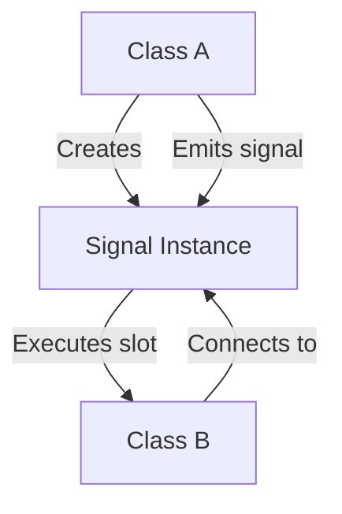

# Introduction

This document will walk you through the implementation of the <SwmToken path="/src/kdbindings/signal.h" pos="44:8:8" line-data=" * @brief A Signal provides a mechanism for communication between objects.">`Signal`</SwmToken> class in the <SwmToken path="/src/kdbindings/signal.h" pos="38:16:16" line-data=" * @brief The main namespace of the KDBindings library.">`KDBindings`</SwmToken> library. The <SwmToken path="/src/kdbindings/signal.h" pos="44:8:8" line-data=" * @brief A Signal provides a mechanism for communication between objects.">`Signal`</SwmToken> class is a core component that facilitates communication between objects in a <SwmToken path="/src/kdbindings/signal.h" pos="51:13:15" line-data=" * This connection happens in a type-safe manner, as a slot can only be connected to">`type-safe`</SwmToken> manner, similar to Qt's Signals & Slots mechanism but implemented in pure C++17.

We will cover:

1. What are Signals.
2. How to use them, including an example.
3. Advanced usage of Signals.

```mermaid

```

# What are Signals

<SwmSnippet path="/src/kdbindings/signal.h" line="31">

---

Signals in <SwmToken path="/src/kdbindings/signal.h" pos="38:16:16" line-data=" * @brief The main namespace of the KDBindings library.">`KDBindings`</SwmToken> provide a mechanism for communication between objects. They allow you to notify any number of slots (callable objects) that a certain event has occurred. This is done in a <SwmToken path="/src/kdbindings/signal.h" pos="51:13:15" line-data=" * This connection happens in a type-safe manner, as a slot can only be connected to">`type-safe`</SwmToken> manner, ensuring that the arguments of the slot match the values the Signal emits. The <SwmToken path="/src/kdbindings/signal.h" pos="44:8:8" line-data=" * @brief A Signal provides a mechanism for communication between objects.">`Signal`</SwmToken> class supports deferred connections, enabling asynchronous or delayed execution of connected slots.

```
#include <kdbindings/connection_evaluator.h>
#include <kdbindings/genindex_array.h>
#include <kdbindings/utils.h>

#include <kdbindings/KDBindingsConfig.h>

/**
 * @brief The main namespace of the KDBindings library.
 *
 * All public parts of KDBindings are members of this namespace.
 */
namespace KDBindings {
/**
 * @brief A Signal provides a mechanism for communication between objects.
 *
 * KDBindings::Signal recreates the <a href="https://doc.qt.io/qt-5/signalsandslots.html">Qt's Signals & Slots mechanism</a> in pure C++17.
 * A Signal can be used to notify any number of slots that a certain event has occurred.
 *
 * The slot can be almost any callable object, including member functions and lambdas.
 *
 * This connection happens in a type-safe manner, as a slot can only be connected to
 * a Signal when the arguments of the slot match the values the Signal emits.
 *
 * The Args type parameter pack describe which value types the Signal will emit.
 *
 * Deferred Connection:
 *
 * KDBindings::Signal supports deferred connections, enabling the decoupling of signal
 * emission from the execution of connected slots. With deferred connections, you can
 * connect slots to the Signal that are not immediately executed when the signal is emitted.
```

---

</SwmSnippet>

# How to use them

To use Signals, you first need to create an instance of the <SwmToken path="/src/kdbindings/signal.h" pos="44:8:8" line-data=" * @brief A Signal provides a mechanism for communication between objects.">`Signal`</SwmToken> class. You can then connect slots to this Signal using the <SwmToken path="/src/kdbindings/signal.h" pos="60:3:3" line-data=" * connect slots to the Signal that are not immediately executed when the signal is emitted.">`connect`</SwmToken> method. When the Signal is emitted, all connected slots are called with the provided arguments.

<SwmSnippet path="/src/kdbindings/signal.h" line="636">

---

Here’s a straightforward example of creating a Signal and connecting a lambda to it:

````
private:
    ConnectionHandle m_handle;
    bool m_wasBlocked{ false };
};

/**
 * @example 01-simple-connection/main.cpp
 *
 * A simple example of how to create a KDBindings::Signal and connect a lambda to it.
 *
 * The output of this example is:
 * ```
 * The answer: 42
 * ```
 */
````

---

</SwmSnippet>

In this example, a <SwmToken path="/src/kdbindings/signal.h" pos="44:8:8" line-data=" * @brief A Signal provides a mechanism for communication between objects.">`Signal`</SwmToken> is created, and a lambda function is connected to it. When the Signal is emitted, the lambda function is executed, printing "The answer: 42".



# Advanced usage

Advanced usage of Signals includes connecting member functions, using deferred connections, and managing connections with <SwmToken path="/src/kdbindings/signal.h" pos="602:8:8" line-data=" * @brief A ConnectionBlocker is a convenient RAII-style mechanism for temporarily blocking a connection.">`ConnectionBlocker`</SwmToken>.

## Connecting member functions

<SwmSnippet path="/src/kdbindings/signal.h" line="652">

---

You can connect member functions to a Signal, allowing them to be called when the Signal is emitted. This is useful for integrating Signals into classes and objects.

````
/**
 * @example 02-signal-member/main.cpp
 *
 * An example of how to connect a member function to a KDBindings::Signal.
 *
 * The output of this example is:
 * ```
 * Hello World!
 * ```
 */
````

---

</SwmSnippet>

## Deferred connections

<SwmSnippet path="/src/kdbindings/signal.h" line="385">

---

Deferred connections allow you to queue the execution of slots until certain conditions are met. This is useful for asynchronous operations where you want to delay the execution of a slot.

```
    /**
     * @brief Establishes a deferred connection between the provided evaluator and slot.
     *
     * @warning Deferred connections are experimental and may be removed or changed in the future.
     *
     * This function allows connecting an evaluator and a slot such that the slot's execution
     * is deferred until the conditions evaluated by the `evaluator` are met.
     *
     * First argument to the function is reference to a shared pointer to the ConnectionEvaluator responsible for determining
     * when the slot should be executed.
     *
     * @return An instance of ConnectionHandle, that can be used to disconnect
     * or temporarily block the connection.
     *
     * @note
     * The Signal class itself is not thread-safe. While the ConnectionEvaluator is inherently
     * thread-safe, ensure that any concurrent access to this Signal is protected externally to maintain thread safety.
     *
     * @warning Connecting functions to a signal that throw an exception when called is currently undefined behavior.
     * All connected functions should handle their own exceptions.
     * For backwards-compatibility, the slot function is not required to be noexcept.
     */
    KDBINDINGS_WARN_UNUSED ConnectionHandle connectDeferred(const std::shared_ptr<ConnectionEvaluator> &evaluator, std::function<void(Args...)> const &slot)
    {
        ensureImpl();
```

---

</SwmSnippet>

## Managing connections

<SwmSnippet path="/src/kdbindings/signal.h" line="601">

---

The <SwmToken path="/src/kdbindings/signal.h" pos="602:8:8" line-data=" * @brief A ConnectionBlocker is a convenient RAII-style mechanism for temporarily blocking a connection.">`ConnectionBlocker`</SwmToken> class provides a convenient <SwmToken path="/src/kdbindings/signal.h" pos="602:16:18" line-data=" * @brief A ConnectionBlocker is a convenient RAII-style mechanism for temporarily blocking a connection.">`RAII-style`</SwmToken> mechanism for temporarily blocking a connection. This is useful when you need to ensure that a connection is not active during certain operations.

```
/**
 * @brief A ConnectionBlocker is a convenient RAII-style mechanism for temporarily blocking a connection.
 *
 * When a ConnectionBlocker is constructed, it will block the connection.
 *
 * When it is destructed, it will return the connection to the blocked state it was in
 * before the ConnectionBlocker was constructed.
 *
 * Example:
 * - @ref 08-managing-connections/main.cpp
 */
class ConnectionBlocker
{
public:
    /**
     * Constructs a new ConnectionBlocker and blocks the connection this ConnectionHandle
     * refers to.
     *
     * @throw std::out_of_range If the connection is not active (i.e. ConnectionHandle::isActive() returns false).
     */
    explicit ConnectionBlocker(const ConnectionHandle &handle)
        : m_handle{ handle }
    {
        m_wasBlocked = m_handle.block(true);
    }
```

---

</SwmSnippet>

By understanding these concepts, you can effectively use <SwmToken path="/src/kdbindings/signal.h" pos="38:16:16" line-data=" * @brief The main namespace of the KDBindings library.">`KDBindings`</SwmToken> Signals in your C++ projects to facilitate communication between objects in a <SwmToken path="/src/kdbindings/signal.h" pos="51:13:15" line-data=" * This connection happens in a type-safe manner, as a slot can only be connected to">`type-safe`</SwmToken> and flexible manner.

<SwmMeta version="3.0.0" repo-id="Z2l0aHViJTNBJTNBS0RCaW5kaW5ncyUzQSUzQUxvaXBmaW5nZXJN" repo-name="KDBindings"><sup>Powered by [Swimm](https://app.swimm.io/)</sup></SwmMeta>
